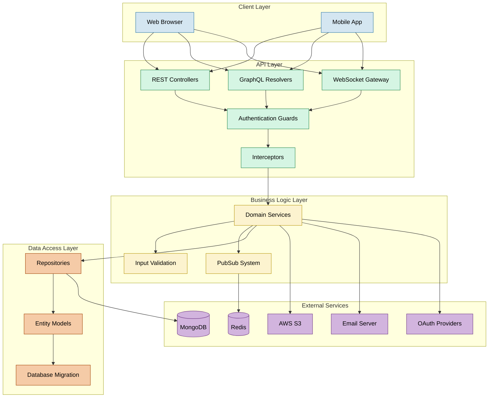
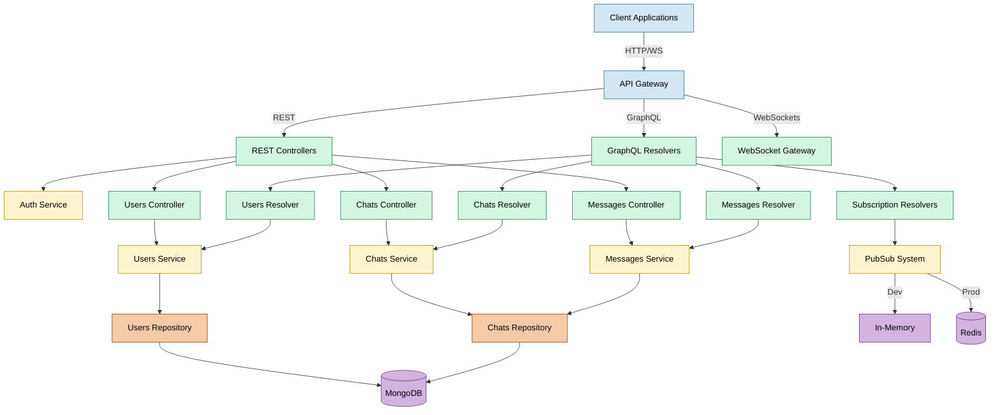
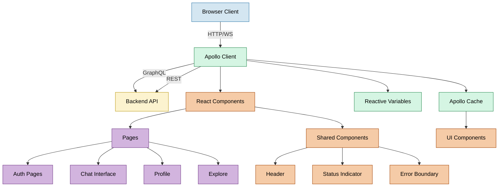

#  Apollo Chat

**A modern real-time chat platform built with React, NestJS, GraphQL, and MongoDB**

[✨ Features](#-features) • [🏗️ Architecture](#️-architecture) • [🛠️ Tech Stack](#️-tech-stack) • [📚 Documentation](#-documentation) • [🔗 Live Demo](https://apollo-chat.aniketdebnath.com)

## 🌟 Overview

Apollo Chat is a full-featured real-time messaging platform that demonstrates modern web development practices. Built with a React frontend and NestJS backend, it leverages GraphQL for efficient data operations and WebSocket subscriptions for real-time updates.

### Key Highlights

- **GraphQL-powered Real-time Communication** with filtered subscription channels and optimized payload delivery
- **Multi-tier Chat Visibility Model** with role-based access control and pinning capabilities
- **WebSocket-driven Presence System** with connection-aware status transitions and live indicators
- **Token-based Authentication Architecture** with refresh rotation and multi-strategy support
- **MongoDB Aggregation Pipelines** for efficient data retrieval with embedded latest messages
- **S3-integrated Media Management** for profile images with secure upload workflows
- **Interactive Onboarding Experience** with guided welcome tour and contextual user interface
- **Subscription Lifecycle Management** with dependency-aware cleanup and race condition prevention
- **Secure Demo Environment** with read-only access and specialized interceptors

<b>📸 Screenshots</b>

 

Screenshots of the application's key features are available in the detailed documentation. See the [Features](docs/frontend/features.md) section for visual examples of the user interface.

## ✨ Features

<table>
  <tr>
    <td width="50%">
      <h3>💬 Real-time Messaging</h3>
      <ul>
        <li>Instant message delivery via Graphql subscriptions</li>
        <li>Message history with pagination</li>
        <li>Optimistic UI updates with Apollo cache integration</li>
        <li>Chat-isolated PubSub channels with member filtering</li>
      </ul>
    </td>
    <td width="50%">
      <h3>👥 Chat Management</h3>
      <ul>
        <li>Create private or public chats</li>
        <li>Add/remove members and moderate chats with ban system</li>
        <li>Pin important conversations</li>
        <li>Discover and join public chats</li>
      </ul>
    </td>
  </tr>
  <tr>
    <td width="50%">
      <h3>👤 User Profiles</h3>
      <ul>
        <li>Custom profile pictures</li>
        <li>Connection-aware WebSocket live status indicators</li>
        <li>User search functionality</li>
        <li>Multi-state status management (online/away/busy/offline)</li>
      </ul>
    </td>
    <td width="50%">
      <h3>🔒 Security Features</h3>
      <ul>
        <li>JWT with HTTP-only cookie rotation protocol</li>
        <li>Multi-strategy authentication (Local/OAuth/JWT)</li>
        <li>Time-limited OTP verification with throttling</li>
        <li>Session tracking with cross-device token revocation</li>
      </ul>
    </td>
  </tr>
  <tr>
    <td width="50%">
      <h3>🎨 UI Features</h3>
      <ul>
        <li>Mobile-first responsive design across devices</li>
        <li>Optimistic UI updates with Apollo cache integration</li>
        <li>Subscription reference tracking with automatic cleanup</li>
        <li>Structured cache operations with pagination merging</li>
      </ul>
    </td>
    <td width="50%">
      <h3>📱 Mobile Experience</h3>
      <ul>
        <li>Touch-optimized drawer interface</li>
        <li>Compact menus for small screens</li>
        <li>Bottom navigation for common actions</li>
        <li>Smart scroll management with position preservation</li>
      </ul>
    </td>
  </tr>
</table>

## 🏗️ Architecture

Apollo Chat follows a modern, layered architecture with clear separation of concerns:

### Backend Architecture

The backend follows NestJS module architecture with GraphQL, REST, and WebSocket support:

### Frontend Architecture

The frontend uses Apollo Client for state management and GraphQL operations:

## 🛠️ Tech Stack

### Frontend

- **Framework**: React 18 with TypeScript
- **State Management**: Apollo Client
- **UI Components**: Material UI 5
- **Routing**: React Router 7
- **Real-time**: GraphQL Subscriptions (graphql-ws)
- **Type Generation**: GraphQL Code Generator
- **Utilities**: date-fns, Framer Motion

### Backend

- **Framework**: NestJS with TypeScript
- **API**: GraphQL (Apollo Server 4), REST (Express)
- **Database**: MongoDB with Mongoose ODM
- **Real-time**: GraphQL Subscriptions with PubSub
- **Authentication**: JWT, Google OAuth 2.0, OTP Verification
- **File Storage**: AWS S3
- **Email**: Nodemailer with SMTP
- **Validation**: class-validator, GraphQL input types
- **Rate Limiting**: NestJS Throttler

### DevOps & CI/CD

- **CI/CD**: GitHub Actions with staging/production workflows
- **Secrets Management**: GitHub Encrypted Secrets
- **Monitoring**: AWS CloudWatch (planned)
- **Logs**: Pino Logger
- **Monitoring (planned)**: AWS CloudWatch or third-party services like Sentry
- **Build System**: Zip deployment packages (Elastic Beanstalk), Amplify build pipelines (frontend)

### Cloud Infrastructure

- **Frontend Hosting**: AWS Amplify
- **Backend Hosting**: AWS Elastic Beanstalk
- **Cache Layer**: Redis OSS on AWS ElastiCache
- **Storage**: AWS S3 (file uploads, profile pictures)
- **CDN**: AWS CloudFront for assets and media
- **DNS Management**: Custom domain managed via GoDaddy using CNAME records
- **Email Services**: Mailgun

### Testing & Documentation

- **Testing**: Jest (unit, integration) and Supertest (e2e), httpyac-endpoints
- **Documentation**: Compodoc (NestJS), Markdown-based frontend docs

## 🔐 Security

Apollo Chat implements a sophisticated zero-trust security architecture with defense-in-depth principles:

### Authentication Mechanisms

- **JWT-based Token Authentication**: Stateless cryptographic tokens with HTTP-only cookie storage
- **Multi-protocol Identity Verification**: OAuth 2.0 integration, credential-based authentication, and OTP verification
- **Token Rotation Protocol**: Secure refresh token mechanism with configurable expiration policies
- **Session Management**: Multi-device login support with cross-device revocation capabilities

### Protection Layer

- **Tiered Rate Limiting**: Endpoint-specific request throttling with customized limits (1/min for OTP, 5/min for verification)
- **Multi-layer Input Validation**: Context-aware sanitization with XSS/injection prevention
- **Access Control**: Role-based permissions with creator/member-specific operations
- **Network Layer Security**: Strict CORS policy with proxy-aware request handling

### Client-Server Security

- **Reactive Authentication State**: Non-persistent token management with automatic refresh mechanism
- **Secure Cookie Implementation**: HTTP-only, SameSite=strict, and Secure flag enforcement
- **Cryptographic Password Storage**: Bcrypt hashing with environment-specific configuration

For comprehensive security implementation details, see the [Security Documentation](docs/infra/security.md) and [Authentication Documentation](docs/core/authentication.md).

## 📚 Documentation

Comprehensive documentation is available in the `docs` directory:

- **Backend**

  - [Architecture](docs/backend/architecture.md)
  - [API Architecture](docs/backend/api-architecture.md)
  - [API Reference](docs/backend/api-reference.md)
  - [Database](docs/backend/database.md)
  - [PubSub System](docs/backend/pubsub.md)

- **Frontend**

  - [Architecture](docs/frontend/architecture.md)
  - [Caching](docs/frontend/caching.md)
  - [Features](docs/frontend/features.md)
  - [Hooks](docs/frontend/hooks.md)
  - [Lifecycle & Effects](docs/frontend/lifecycle-and-effect.md)

- **Core Modules**

  - [Authentication](docs/core/authentication.md)
  - [Users](docs/core/users.md)
  - [Chats](docs/core/chats.md)
  - [Messages](docs/core/messages.md)

- **Infrastructure**
  - [Deployment](docs/infra/deployment.md)
  - [Security](docs/infra/security.md)

## 📄 License

This project is licensed under the MIT License - see the LICENSE file for details.

## 🙏 Acknowledgements

- [NestJS](https://nestjs.com/) - The progressive Node.js framework
- [React](https://reactjs.org/) - A JavaScript library for building user interfaces
- [Apollo GraphQL](https://www.apollographql.com/) - The GraphQL implementation
- [MongoDB](https://www.mongodb.com/) - The database for modern applications
- [Material UI](https://mui.com/) - React components for faster and easier web development
