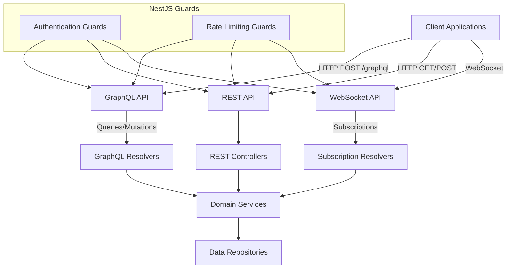

# Apollo Chat API Layer Architecture

## Overview

Apollo Chat implements a multi-protocol API architecture that leverages the strengths of different communication protocols:

1. **GraphQL API**: Primary interface for complex data operations and queries
2. **REST API**: Traditional HTTP endpoints for simple operations and authentication
3. **WebSocket API**: Real-time communication via GraphQL subscriptions

This hybrid approach provides flexibility, performance, and developer experience benefits while maintaining consistency across interfaces.

## API Architecture Diagram



## GraphQL API

GraphQL serves as the primary API interface for Apollo Chat, providing a flexible query language for complex data operations.

### Implementation

- **Apollo Server 4**: Powers the GraphQL engine
- **Code-first Approach**: Uses NestJS decorators to define schema
- **Type Safety**: Leverages TypeScript for end-to-end type safety

### Key Components

#### Schema Definition

```typescript
@ObjectType()
export class Chat extends AbstractEntity {
  @Field()
  creatorId: string;

  @Field()
  name: string;

  @Field(() => [User])
  members: User[];

  @Field(() => [Message], { nullable: true })
  messages?: Message[];

  @Field(() => [BannedUser], { nullable: true })
  bannedUsers?: BannedUser[];
}
```

#### Resolvers

```typescript
@Resolver(() => Chat)
export class ChatsResolver {
  @Query(() => [Chat])
  @UseGuards(GqlAuthGuard)
  async chats(@CurrentUser() user: User): Promise<Chat[]> {
    return this.chatsService.findAll(user._id);
  }

  @Mutation(() => Chat)
  @UseGuards(GqlAuthGuard)
  async createChat(
    @Args("createChatInput") createChatInput: CreateChatInput,
    @CurrentUser() user: User
  ): Promise<Chat> {
    return this.chatsService.create(createChatInput, user);
  }
}
```

#### Subscriptions

```typescript
@Resolver(() => Message)
export class MessagesResolver {
  @Subscription(() => Message, {
    filter: (payload, variables, context) => {
      // Filter logic to determine if client should receive event
      return variables.chatIds.includes(payload.messageCreated.chatId);
    },
  })
  messageCreated(@Args() args: MessageCreatedArgs) {
    return this.pubSub.asyncIterableIterator(MESSAGE_CREATED);
  }
}
```

### GraphQL-Specific Guards

```typescript
@Injectable()
export class GqlAuthGuard extends AuthGuard("jwt") {
  // Custom logic to extract JWT from GraphQL context
  getRequest(context: ExecutionContext) {
    const ctx = GqlExecutionContext.create(context);
    return ctx.getContext().req;
  }
}
```

## REST API

The REST API provides traditional HTTP endpoints for core operations, particularly authentication flows and simple CRUD operations.

### Implementation

- **NestJS Controllers**: Handle HTTP requests
- **Express.js**: Underlying HTTP server

### Key Components

#### Controllers

```typescript
@Controller("auth")
export class AuthController {
  @Post("login")
  @UseGuards(LocalAuthGuard)
  async login(@Request() req): Promise<AuthResponse> {
    return this.authService.login(req.user);
  }

  @Post("register")
  async register(@Body() createUserDto: CreateUserDto): Promise<AuthResponse> {
    return this.authService.register(createUserDto);
  }

  @Get("google")
  @UseGuards(GoogleAuthGuard)
  googleAuth() {
    // Initiates Google OAuth flow
  }
}
```

#### DTOs

```typescript
export class CreateUserDto {
  @IsEmail()
  email: string;

  @IsString()
  @MinLength(3)
  username: string;

  @IsString()
  @MinLength(8)
  password: string;
}
```

#### REST-Specific Guards

```typescript
@Injectable()
export class JwtAuthGuard extends AuthGuard("jwt") {
  // Custom JWT validation for REST endpoints
}
```

## WebSocket API

WebSockets enable real-time communication through GraphQL subscriptions, providing instant updates for messages, user status, and chat changes.

### Implementation

- **GraphQL Subscriptions**: Powered by Apollo Server
- **PubSub System**: In-memory (dev) or Redis-based (production)
- **Filtered Events**: Clients receive only relevant updates

### Key Components

#### Subscription Setup

```typescript
// Client-side subscription setup
const messageSubscription = gql`
  subscription OnMessageCreated($chatIds: [String!]!) {
    messageCreated(chatIds: $chatIds) {
      _id
      content
      createdAt
      user {
        _id
        username
      }
      chatId
    }
  }
`;

// Subscribe to new messages
client
  .subscribe({
    query: messageSubscription,
    variables: { chatIds: ["chat-id-1", "chat-id-2"] },
  })
  .subscribe({
    next(data) {
      // Handle new message
    },
  });
```

#### Server-side Implementation

```typescript
// Server-side subscription resolver
@Resolver(() => User)
export class UsersResolver {
  @Subscription(() => User)
  userStatusChanged() {
    return this.pubSub.asyncIterableIterator(USER_STATUS_CHANGED);
  }
}
```

## Protocol Integration

Apollo Chat seamlessly integrates all three protocols:

### Authentication Flow

1. **REST**: Initial authentication via /auth/login or OAuth endpoints
2. **JWT**: Access token used across all protocols
3. **GraphQL Context**: JWT extracted from Authorization header
4. **WebSocket Handshake**: JWT validated during connection setup

### Cross-Protocol Guards

```typescript
// Base authentication logic shared across protocols
@Injectable()
export class AuthService {
  async validateUser(email: string, password: string): Promise<User> {
    // Shared validation logic used by both REST and GraphQL
  }

  async validateToken(token: string): Promise<User> {
    // Shared token validation used by REST, GraphQL, and WebSockets
  }
}
```

## API Consistency

To maintain consistency across protocols:

1. **Shared Services**: Business logic in domain services used by all interfaces
2. **Consistent DTOs**: Input validation shared between GraphQL inputs and REST DTOs
3. **Unified Error Handling**: Common error format across all protocols
4. **Centralized Guards**: Authentication and rate limiting applied consistently

## Protocol Selection Guidelines

### When to Use GraphQL

- Complex queries requiring multiple related resources
- Operations needing specific field selection
- Batch operations to reduce round trips

### When to Use REST

- Simple CRUD operations
- Authentication flows
- File uploads
- External API integrations requiring REST

### When to Use WebSockets

- Real-time updates (messages, status changes)
- Live collaborative features
- Events that should be pushed to clients immediately

## Performance Considerations

1. **Rate Limiting**: All protocols protected by consistent rate limiting
2. **Caching**: REST endpoints leverage HTTP caching mechanisms
3. **Persistence**: WebSocket connections reduce connection overhead

## Security Measures

1. **Authentication Guards**: Protect all endpoints across protocols
2. **Input Validation**: Validate all inputs regardless of protocol
3. **Rate Limiting**: Apply rate limits to prevent abuse
4. **CORS Configuration**: Restrict origins for all protocols

## Future Considerations

1. **GraphQL Federation**: Potential for distributed GraphQL implementation
2. **WebSocket Clustering**: Scaling WebSocket connections across instances
3. **API Versioning**: Strategy for evolving APIs while maintaining compatibility
4. **GraphQL Persisted Queries**: Security and performance optimization
5. **Batching**: GraphQL enables request batching to reduce HTTP overhead
