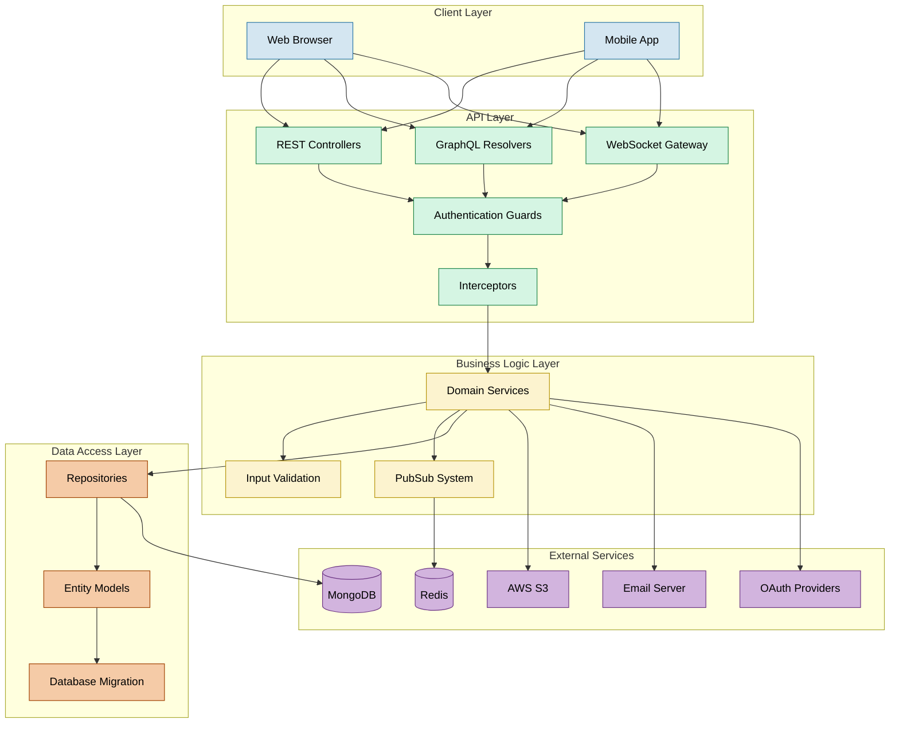
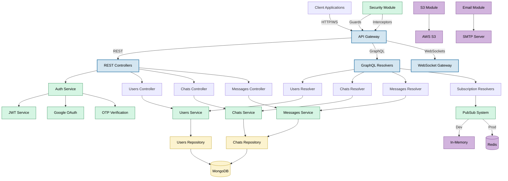

# Apollo Chat Backend Architecture

## System Overview

Apollo Chat is a real-time messaging platform built with NestJS, GraphQL, and MongoDB. The architecture follows modern best practices for scalable, maintainable, and secure applications, with a focus on real-time communication, security, and scalability.

**For detailed backend architecture and implementation guides, see:**

- [API Architecture](./api-architecture.md) – Overview of REST, GraphQL, and WebSocket gateway design
- [API Reference](./api-reference.md) – Detailed schema, endpoints, and resolver documentation
- [Core Modules](../core) – Authentication, Users, Chats, and Messages modules
- [Database](./database.md) – MongoDB schema design and indexing strategies
- [PubSub System](./pubsub.md) – Event-driven communication with Redis and in-memory fallback
- [Infrastructure > Deployment](../infra/deployment.md) – CI/CD, infrastructure, deployment
- [Infrastructure > Security](../infra/security.md) – Guards, interceptors, validation, and threat mitigation

## Tech Stack

| Layer           | Technology                                |
| --------------- | ----------------------------------------- |
| Language        | TypeScript                                |
| Framework       | [NestJS](https://nestjs.com/)             |
| API Layer       | GraphQL (Apollo Server 4), REST (Express) |
| Realtime Engine | GraphQL Subscriptions with PubSub         |
| Database        | MongoDB (via Mongoose ODM)                |
| Data Access     | AbstractRepository Pattern (custom)       |
| Messaging Queue | Redis (for PubSub events in production)   |
| Auth & Identity | JWT, Google OAuth 2.0, OTP Verification   |
| Email Delivery  | Nodemailer with configurable SMTP         |
| File Storage    | AWS S3 (via AWS SDK)                      |
| Validation      | class-validator, GraphQL input types      |
| Rate Limiting   | NestJS Throttler with proxy-aware guards  |
| Documentation   | Compodoc                                  |
| Testing         | Jest, Supertest                           |

## Layered Architecture

This diagram outlines Apollo Chat's high-level layered backend architecture, covering client interaction, API gateways, business logic, and external services.

## Internal Service Flow (Controller-Service-Repo Mapping)

This diagram visualizes detailed interactions between controllers, resolvers, services, PubSub system, and data repositories in the backend.

## Core Architectural Principles

1. **Modular Design**: The application is divided into feature modules (auth, users, chats, messages) with clear boundaries
2. **Layered Architecture**: Controllers/Resolvers → Services → Repositories → Database
3. **Dependency Injection**: NestJS DI container manages service lifecycles and dependencies
4. **Domain-Driven Design**: Business logic is encapsulated in domain services
5. **Repository Pattern**: Data access is abstracted through repositories

## Feature Modules

### Authentication Module

The Auth module provides comprehensive authentication and authorization:

- **Multiple Authentication Strategies**: JWT, Local (username/password), and Google OAuth
- **Token Management**: Access tokens with HTTP-only cookies and refresh token rotation
- **Cross-Protocol Authentication**: Unified authentication across REST, GraphQL, and WebSockets
- **OTP Verification**: Time-limited one-time passwords for email verification and password reset
- **Session Tracking**: Multi-device login support with cross-device revocation capabilities
- **Guards**: Protocol-specific guards for protecting routes, resolvers, and subscriptions
- **Rate Limiting**: Tiered rate limiting with proxy-aware IP detection

For detailed information about the authentication architecture, see the [authentication documentation](../core/authentication.md).

### Users Module

Manages user accounts, profiles, and status:

- **User Registration**: Account creation and validation
- **Profile Management**: Update user information
- **Status Tracking**: Real-time user status updates

For detailed information about the users architecture, see the [users documentation](../core/users.md).

### Chats Module

Handles chat rooms, conversations, and membership:

- **Chat Types**: Private, public, and open chat rooms
- **Membership Management**: Add/remove members, join requests
- **Chat Pinning**: User-specific chat pinning functionality
- **Ban System**: Configurable user bans (1 day, 1 week, 1 month, permanent)

For detailed information about the chats architecture, see the [chats documentation](../core/chats.md).

### Messages Module

Manages message creation, retrieval, and real-time updates:

- **Message Creation**: Send messages to chats
- **Pagination**: Efficient message retrieval with pagination
- **Real-time Updates**: Subscription-based message notifications

For detailed information about the messages architecture, see the [messages documentation](../core/messages.md).

## API Layer

Apollo Chat provides multiple API interfaces:

1. **GraphQL API**: Rich query language for complex data operations (primary interface)

   - Apollo Server 4 as the GraphQL engine
   - Schema-first approach with GraphQL decorators
   - Subscription support for real-time updates

2. **REST API**: Traditional HTTP endpoints for core operations (e.g., /auth/login, /chats/count)

3. **WebSocket Subscriptions**: Real-time updates via GraphQL subscriptions

4. **Cross-Protocol Authentication**: Secure HTTP-only cookies for consistent authentication across all protocols

For detailed information about the API architecture, see the [api-architecture documentation](./api-architecture.md).

For a complete API reference, see the [API reference documentation](./api-reference.md).

## Module Structure

Each feature module follows a consistent structure:

- **Controllers/Resolvers**: Handle HTTP/GraphQL requests
- **Services**: Implement business logic
- **Entities**: Define domain models
- **DTOs**: Define data transfer objects
- **Repositories**: Handle data persistence

## Database Layer

MongoDB serves as the primary data store with a document-oriented model:

- **Abstract Repository Pattern**: Common CRUD operations in base class
- **Specialized Repositories**: Feature-specific data access methods
- **Entity Mapping**: Dual-model approach (Document classes and GraphQL types)
- **Aggregation Pipelines**: Complex data operations for efficient queries

For detailed information about the database architecture, see the [database documentation](./database.md).

## Real-Time Communication

The PubSub system enables real-time updates:

- **Environment-Aware Implementation**: In-memory for development, Redis for production
- **Event Channels**: Specific channels for different update types
- **Filtered Subscriptions**: Clients receive only relevant events
- **JSON Reviver**: Proper serialization/deserialization of dates and ObjectIds

For detailed information about the PubSub implementation, see the [PubSub documentation](./pubsub.md).

## Security Architecture

Apollo Chat implements multi-layered security with authentication guards, input sanitization, and rate limiting. The system secures both GraphQL and REST layers through specialized guards and interceptors.

### Authentication & Authorization

- **JWT Authentication**: JwtAuthGuard for REST endpoints
- **GraphQL Authentication**: GqlAuthGuard adapts JWT authentication for GraphQL
- **OAuth Integration**: GoogleAuthGuard for social login
- **Local Authentication**: LocalAuthGuard for username/password login

### Rate Limiting

- **Global Throttling**: ThrottlerModule with custom ThrottlerBehindProxyGuard for accurate client IP detection
- **GraphQL Protection**: ThrottlerGqlGuard extends protection to GraphQL operations
- **OTP-Specific Limits**: OtpThrottlerGuard implements endpoint-specific rate limiting:
  - Send OTP: 1 request per minute
  - Verify OTP: 5 attempts per minute
  - Check email verified: 10 checks per minute

### Input Protection

- **SecurityInterceptor**: Intercepts HTTP requests to:

  - Detect suspicious patterns in user agents and request paths
  - Sanitize input fields to prevent XSS attacks
  - Block potential SQL injection attempts

- **Input Validation**: DTO validation with class-validator
- **Password Security**: Secure password hashing with bcrypt
- **OTP Security**: Time-limited one-time passwords with rate limiting

For detailed information about the security architecture, see the [security documentation](../infra/security.md).

## External Services Integration

### File Storage (S3)

The S3 module provides secure file storage capabilities:

- **Image Uploads**: Profile pictures and chat images
- **Access Control**: Secure URL generation for authorized access
- **Validation**: File type and size validation

### Email Service

The Email module handles all outbound communications:

- **Transactional Emails**: Account verification, password reset
- **Templating**: Consistent email templates
- **Configuration**: Environment-specific SMTP settings

## Logging Architecture

Apollo Chat implements a comprehensive logging system using Pino logger integrated with NestJS:

- **Environment-Specific Configuration**:

  - Production: JSON-formatted logs with 'info' level
  - Development: Human-readable logs with 'pino-pretty' formatter and 'debug' level

- **Layered Logging Strategy**:

  - **Repository Layer**: Each repository extends AbstractRepository with a protected logger
  - **Service Layer**: Service-specific loggers for operation tracking and error handling
  - **API Layer**: Request logging and error tracking
  - **Security Layer**: Dedicated logging for authentication and security events

- **Specialized Loggers**:

  - **WebSocket Authentication**: Tracks connection and token refresh events
  - **Email Service**: Logs email delivery attempts and failures
  - **S3 Service**: Tracks file upload operations
  - **Security Interceptor**: Logs potential security threats

- **Database Operations Logging**:
  - Document creation/update/deletion tracking
  - Query failure logging with context
  - Migration operation logging

The logging system is designed to provide comprehensive visibility into application behavior while maintaining performance in production environments.

## Scalability Considerations

1. **Horizontal Scaling**: Stateless design enables multiple instances
2. **Redis PubSub**: Enables cluster-wide real-time communication
3. **Connection Pooling**: Efficient database connection management
4. **Pagination**: All list operations support skip/limit pagination
5. **Indexing Strategy**: Optimized MongoDB indexes for common queries

## Testing

Apollo Chat implements a comprehensive testing strategy:

- **Unit Testing**: Individual components tested in isolation
- **Integration Testing**: Testing interactions between components
- **E2E Testing**: End-to-end testing of complete features
- **HTTP Endpoint Testing**: REST API endpoints tested with Supertest
- **GraphQL Testing**: GraphQL operations tested with Apollo Server testing utilities

Testing documentation will be released when it's completed.

## Future Considerations

1. **Microservices**: Potential evolution to microservice architecture using NestJS ClientsModule
2. **CQRS Pattern**: Separate read and write operations for scaling
3. **GraphQL Federation**: Distributed GraphQL implementation
4. **Serverless Functions**: For specific isolated functionality
