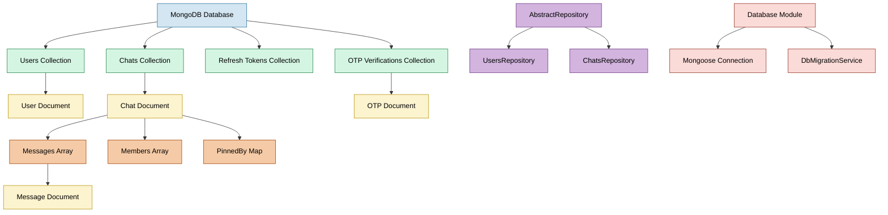
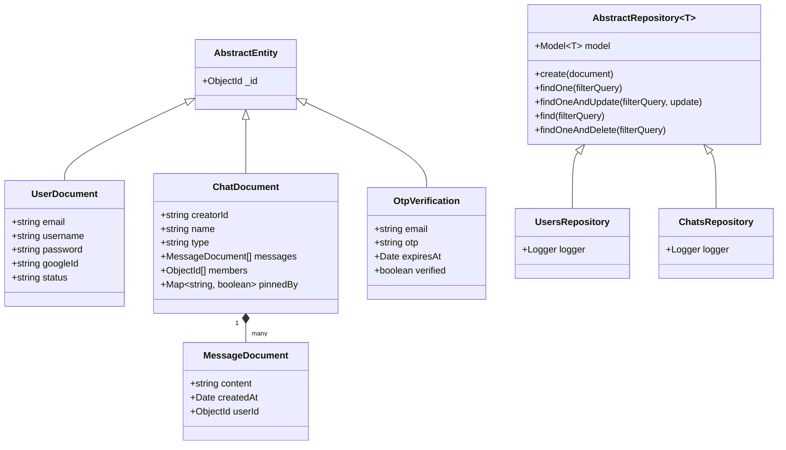

# Apollo Chat Database Architecture

## Overview

Apollo Chat uses MongoDB as its primary database, implementing a document-oriented data model that supports the application's real-time messaging and social features. The database architecture follows a repository pattern with abstract base classes providing common CRUD operations across collections.

## Database Structure Diagram

### Collections and Documents



### Class Diagram



Apollo Chat uses MongoDB as its primary database, implementing a document-oriented data model that supports the application's real-time messaging and social features. The database architecture follows a repository pattern with abstract base classes providing common CRUD operations across collections.

## Database Structure

### Collections

Apollo Chat's data model consists of four primary collections:

1. **Users** - Stores user account information and authentication details
2. **Chats** - Stores chat conversations, including embedded messages
3. **Refresh Tokens** - Stores JWT refresh tokens for authentication
4. **OTP Verifications** - Stores one-time passwords for email verification and password resets

### Relationships

The database uses a combination of embedded documents and references:

- **Embedded Documents**: Messages are embedded within Chat documents for efficient retrieval
- **References**: Chat members and creators are referenced by ObjectId to User documents
- **Maps**: Features like chat pinning use MongoDB Maps for user-specific settings

## Schema Design

### User Collection

```typescript
// UserDocument Schema
{
  _id: ObjectId,            // Unique identifier
  email: string,            // User's email (unique, indexed)
  username: string,         // Display name
  password?: string,        // Hashed password (optional for OAuth users)
  googleId?: string,        // Google OAuth ID (optional)
  status: string            // User's online status (ONLINE, OFFLINE, AWAY, DND)
}
```

### Chat Collection

```typescript
// ChatDocument Schema
{
  _id: ObjectId,            // Unique identifier
  creatorId: string,        // User ID of chat creator
  name: string,             // Chat name (optional for private chats)
  type: string,             // 'private', 'public', or 'open'
  messages: [               // Embedded array of messages
    {
      _id: ObjectId,        // Message identifier
      content: string,      // Message content
      createdAt: Date,      // Timestamp
      userId: ObjectId      // Reference to message author
    }
  ],
  members: [ObjectId],      // Array of user IDs who are members
  pinnedBy: {               // Map of user IDs to boolean for pinned status
    "userId1": true,
    "userId2": true
  }
}
```

### OTP Verification Collection

```typescript
// OtpVerification Schema
{
  _id: ObjectId,            // Unique identifier
  email: string,            // User's email address
  otp: string,              // One-time password code (typically 6 digits)
  expiresAt: Date,          // Expiration timestamp (typically 15 minutes)
  verified: boolean         // Whether the OTP has been used successfully
}
```

### Indexes

The database utilizes several indexes to optimize query performance:

- **Email Index**: Unique index on User.email for fast lookups and to enforce uniqueness
- **Chat Members + Type Index**: Compound index on Chat.members and Chat.type for efficient filtering
- **OTP Email Index**: Index on OtpVerification.email for fast lookups during verification

## Database Access Layer

### Abstract Repository Pattern

Apollo Chat implements a repository pattern with an abstract base class that provides common CRUD operations:

```typescript
// AbstractRepository provides common database operations
export abstract class AbstractRepository<T extends AbstractEntity> {
  // Core CRUD operations
  async create(document: Omit<T, "_id">): Promise<T>;
  async findOne(filterQuery: FilterQuery<T>): Promise<T>;
  async findOneAndUpdate(
    filterQuery: FilterQuery<T>,
    update: UpdateQuery<T>
  ): Promise<T>;
  async find(filterQuery: FilterQuery<T>): Promise<T[]>;
  async findOneAndDelete(filterQuery: FilterQuery<T>): Promise<T>;
}
```

Specialized repositories extend this base class:

- **UsersRepository**: Handles user document operations
- **ChatsRepository**: Handles chat document operations

### Entity Mapping

The application uses a dual-model approach:

1. **Document Classes**: Define MongoDB schema (e.g., UserDocument, ChatDocument)
2. **Entity Classes**: Define GraphQL types (e.g., User, Chat)

Services map between these two representations, ensuring proper data transformation.

## Advanced Query Patterns

### Aggregation Pipelines

Apollo Chat leverages MongoDB's aggregation framework for complex data operations:

#### Chat Retrieval with Latest Message

```typescript
// Aggregation pipeline to get chats with latest message and member data
const pipeline = [
  { $match: { members: userId } }, // Filter by membership
  {
    $set: {
      // Set latest message
      latestMessage: {
        $cond: [
          "$messages",
          { $arrayElemAt: ["$messages", -1] },
          { createdAt: new Date() },
        ],
      },
    },
  },
  { $sort: { "latestMessage.createdAt": -1 } }, // Sort by latest message
  {
    $lookup: {
      /* Join with users collection */
    },
  }, // Populate user data
];
```

#### Paginated Message Retrieval

```typescript
// Aggregation pipeline to get paginated messages with user data
const messages = await this.chatsRepository.model.aggregate([
  { $match: { _id: chatId } }, // Find specific chat
  { $unwind: "$messages" }, // Flatten messages array
  { $replaceRoot: { newRoot: "$messages" } }, // Promote messages to root
  { $sort: { createdAt: -1 } }, // Sort newest first
  { $skip: skip }, // Apply pagination
  { $limit: limit },
  {
    $lookup: {
      /* Join with users collection */
    },
  }, // Populate user data
]);
```

## Database Migration

Apollo Chat uses migrate-mongo for database schema migrations:

```typescript
// DbMigrationService runs migrations on application startup
@Injectable()
export class DbMigrationService implements OnModuleInit {
  async onModuleInit() {
    config.set(this.dbMigrationConfig);
    const { db, client } = await database.connect();
    await up(db, client); // Apply pending migrations
  }
}
```

Example migration to create an email index:

```typescript
// user-email-index.ts migration
module.exports = {
  async up(db: Db) {
    await db.collection("users").createIndex({ email: 1 }, { unique: true });
  },
};
```

## Performance Considerations

1. **Embedded Messages**: Messages are embedded within chats for efficient retrieval of conversation history
2. **Indexing Strategy**: Compound indexes support common query patterns
3. **Pagination**: All list operations support skip/limit pagination
4. **Projection**: Queries use projection to limit returned fields when appropriate

## Best Practices

1. **Error Handling**: Repository methods include proper error logging and exception handling
2. **Transactions**: Critical operations use MongoDB transactions where appropriate
3. **Lean Queries**: Queries use .lean() to improve performance by returning plain JavaScript objects
4. **Validation**: Schema-level validation ensures data integrity

## Connection Configuration

Database connection is configured via environment variables:

```typescript
// Database module configuration
MongooseModule.forRootAsync({
  useFactory: (configService: ConfigService) => ({
    uri: configService.get("MONGO_URI"),
  }),
  inject: [ConfigService],
});
```
