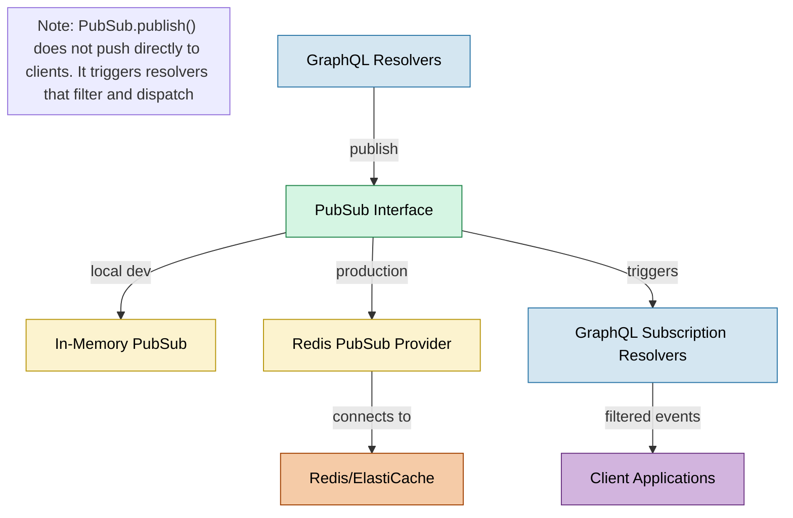
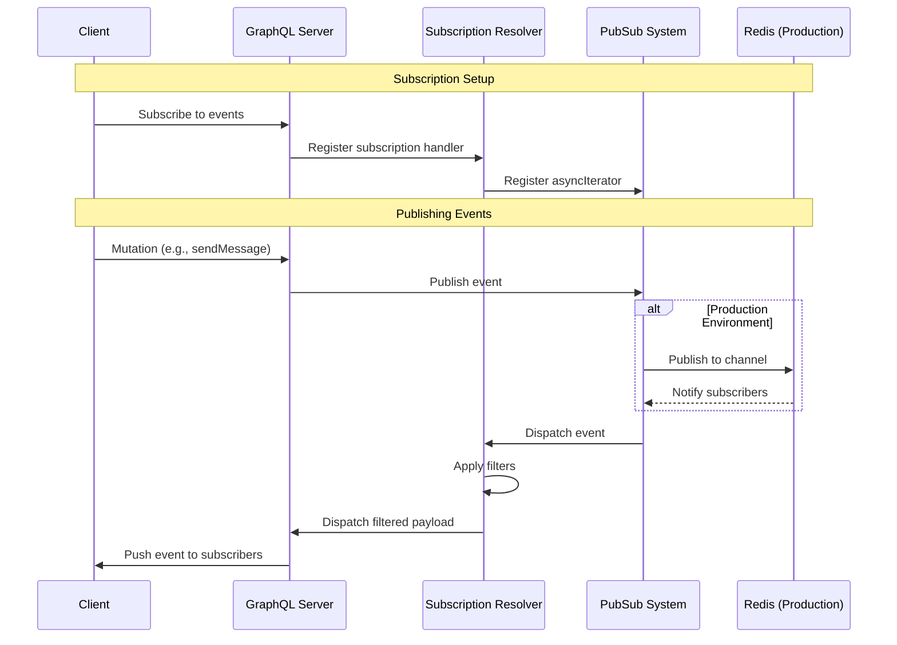

# Apollo Chat PubSub System

## Overview

Apollo Chat implements a real-time communication system using GraphQL subscriptions powered by PubSub. The system provides seamless real-time updates for chat messages, user status changes, and chat management operations. The implementation supports both local development with in-memory PubSub and production deployment with Redis-based PubSub.

## Architecture



### Event Flow



## Core Components

### PubSub Module

The `PubSubModule` is a global module that provides a consistent PubSub implementation across the application:

```typescript
@Global()
@Module({
  providers: [
    {
      provide: PUB_SUB,
      useFactory: (configService: ConfigService) => {
        if (configService.get("NODE_ENV") === "production") {
          // Redis-based PubSub for production
          return new RedisPubSub({
            publisher: new Redis(options),
            subscriber: new Redis(options),
            reviver,
          });
        }
        // In-memory PubSub for development
        return new PubSub();
      },
      inject: [ConfigService],
    },
  ],
  exports: [PUB_SUB],
})
export class PubSubModule {}
```

### Event Channels

Apollo Chat defines specific event channels for different types of real-time updates:

```typescript
// User events
export const USER_STATUS_CHANGED = "user.status.changed";

// Chat events
export const CHAT_ADDED = "chatAdded";
export const CHAT_DELETED = "chatDeleted";

// Message events
export const MESSAGE_CREATED = "messageCreated";
```

### JSON Reviver

The system includes a custom reviver function to properly deserialize dates and MongoDB ObjectIds when using Redis:

```typescript
export const reviver = (key: string, value: any): any => {
  // Convert ISO date strings back to Date objects
  const isISO8601Z =
    /^(\d{4})-(\d{2})-(\d{2})T(\d{2}):(\d{2}):(\d{2}(?:\.\d*)?)Z$/;
  if (typeof value === "string" && isISO8601Z.test(value)) {
    const tempDateNumber = Date.parse(value);
    if (!isNaN(tempDateNumber)) {
      return new Date(tempDateNumber);
    }
  }
  // Convert string IDs back to MongoDB ObjectIds
  if (key === "_id") {
    return new Types.ObjectId(String(value));
  }
  return value;
};
```

## Implementation Examples

### Publishing Events

Events are published when state changes occur:

```typescript
// Publishing a user status change
this.pubSub.publish(USER_STATUS_CHANGED, {
  userStatusChanged: updatedUser,
});

// Publishing a new message
await this.pubSub.publish(MESSAGE_CREATED, {
  messageCreated: message,
});

// Publishing a new chat
this.pubSub.publish(CHAT_ADDED, { chatAdded: chat });
```

### Subscription Resolvers

GraphQL subscription resolvers create async iterators for event streams:

```typescript
@Subscription(() => User)
userStatusChanged() {
  return this.pubSub.asyncIterableIterator(USER_STATUS_CHANGED);
}

@Subscription(() => Message)
messageCreated() {
  return this.pubSub.asyncIterableIterator(MESSAGE_CREATED);
}
```

### Filtering Subscriptions

Apollo Chat implements filtering to ensure clients only receive relevant events:

```typescript
@Subscription(() => Message, {
  filter: (
    payload: MessageCreatedPayload,
    variables: MessageCreatedArgs,
    context: SubscriptionContext,
  ) => {
    const userId = String(context.req.user._id);
    const { messageCreated } = payload;
    const messageUserId = String(messageCreated.user._id);

    return (
      variables.chatIds.includes(messageCreated.chatId) &&
      userId !== messageUserId
    );
  },
})
messageCreated(@Args() args: MessageCreatedArgs) {
  return this.messagesService.messageCreated();
}
```

## Environment Configuration

The PubSub system automatically adapts to the environment:

- **Development**: Uses in-memory PubSub for simplicity
- **Production**: Uses Redis-based PubSub for scalability

Redis configuration is managed through environment variables:

```
REDIS_HOST=your-redis-host
REDIS_PORT=6379
```

## Best Practices

1. **Payload Consistency**: Always include the full entity in the payload
2. **Event Naming**: Use consistent naming conventions for event channels
3. **Filtering**: Implement filtering to reduce unnecessary network traffic
4. **Error Handling**: Wrap PubSub operations in try/catch blocks
5. **Scalability**: Use Redis PubSub in production for horizontal scaling
