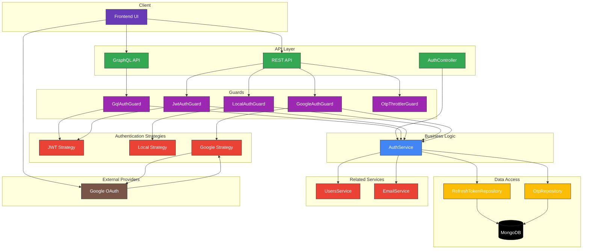

# Authentication Module Documentation

## Overview

The Authentication module in Apollo Chat provides a secure, multi-strategy authentication system with features including:

- JWT-based authentication with refresh token rotation
- Username/password authentication
- Google OAuth integration
- One-time password (OTP) verification
- Password reset flow
- Session management across devices
- Rate limiting for sensitive operations

This document provides a detailed overview of the authentication system's architecture, components, and API endpoints.

## Architecture

The authentication system follows a modular design with clear separation of concerns:



## Core Components

### Authentication Strategies

#### JWT Strategy (`jwt.strategy.ts`)

Implements Passport strategy for JWT authentication. Extracts and validates JWT tokens from cookies.

```typescript
@Injectable()
export class JwtStrategy extends PassportStrategy(Strategy) {
  constructor(private readonly configService: ConfigService) {
    super({
      jwtFromRequest: ExtractJwt.fromExtractors([
        (request: Request) => request.cookies.Authentication,
      ]),
      secretOrKey: configService.getOrThrow("JWT_SECRET"),
    });
  }

  validate(payload: TokenPayload) {
    return payload;
  }
}
```

#### Local Strategy (`local.strategy.ts`)

Implements Passport strategy for username/password authentication. Validates user credentials against the database.

```typescript
@Injectable()
export class LocalStrategy extends PassportStrategy(Strategy) {
  constructor(private readonly usersService: UsersService) {
    super({
      usernameField: "email",
    });
  }

  async validate(email: string, password: string) {
    try {
      return await this.usersService.verifyUser(email, password);
    } catch (err) {
      throw new UnauthorizedException("Credentials are not valid");
    }
  }
}
```

#### Google Strategy (`google.strategy.ts`)

Implements Passport strategy for Google OAuth authentication. Enables users to sign in using their Google accounts.

```typescript
@Injectable()
export class GoogleStrategy extends PassportStrategy(Strategy, "google") {
  constructor(
    private readonly configService: ConfigService,
    private readonly usersService: UsersService
  ) {
    const clientID = configService.get<string>("GOOGLE_CLIENT_ID") || "";
    const clientSecret =
      configService.get<string>("GOOGLE_CLIENT_SECRET") || "";
    const callbackURL = configService.get<string>("GOOGLE_CALLBACK_URL") || "";

    super({
      clientID,
      clientSecret,
      callbackURL,
      scope: ["email", "profile"],
    });
  }

  async validate(accessToken: string, refreshToken: string, profile: Profile) {
    // Find or create user with Google profile data
    // ...
  }
}
```

### Authentication Guards

#### JWT Auth Guard (`jwt-auth.guard.ts`)

Protects routes that require JWT authentication.

```typescript
export class JwtAuthGuard extends AuthGuard("jwt") {}
```

#### Local Auth Guard (`local-auth.guard.ts`)

Protects routes that require username/password authentication.

```typescript
export class LocalAuthGuard extends AuthGuard("local") {}
```

#### Google Auth Guard (`google-auth.guard.ts`)

Protects routes that require Google OAuth authentication.

```typescript
@Injectable()
export class GoogleAuthGuard extends AuthGuard("google") {}
```

#### GraphQL Auth Guard (`gql-auth.guard.ts`)

Protects GraphQL operations that require authentication.

```typescript
export class GqlAuthGuard extends AuthGuard("jwt") {
  getRequest(context: ExecutionContext): Request {
    const ctx = GqlExecutionContext.create(context);
    const request = ctx.getContext<{ req: Request }>().req;
    return request;
  }
}
```

#### OTP Throttler Guard (`otp-throttler.guard.ts`)

Provides rate limiting for OTP-related endpoints to prevent abuse.

```typescript
@Injectable()
export class OtpThrottlerGuard extends ThrottlerBehindProxyGuard {
  protected getTrackerOptions(context: ExecutionContext): ThrottlerOptions {
    const request = this.getRequestResponse(context).req;
    const path = request.path || "";

    // Set different limits based on the endpoint
    if (path.includes("/auth/send-otp")) {
      return {
        ttl: 60000, // 1 minute
        limit: 1, // 1 request per minute
      };
    }
    // ...
  }
}
```

### Entities

#### Refresh Token (`refresh-token.entity.ts`)

Represents a refresh token issued to a user during authentication.

```typescript
@Schema({ versionKey: false })
export class RefreshToken extends AbstractEntity {
  @Prop({ type: Types.ObjectId, ref: "User", required: true })
  userId: Types.ObjectId;

  @Prop({ required: true })
  token: string;

  @Prop({ required: true })
  expiresAt: Date;

  @Prop({ default: false })
  revoked: boolean;

  // Additional fields...
}
```

#### OTP Verification (`otp.entity.ts`)

Represents a one-time password issued for email verification or password reset.

```typescript
@Schema({ versionKey: false })
export class OtpVerification extends AbstractEntity {
  @Prop({ required: true })
  email: string;

  @Prop({ required: true })
  otp: string;

  @Prop({ required: true })
  expiresAt: Date;

  @Prop({ default: false })
  verified: boolean;
}
```

### Decorators

#### Current User (`current-user.decorator.ts`)

Provides a convenient way to access the authenticated user in both HTTP and GraphQL contexts.

```typescript
export const CurrentUser = createParamDecorator(
  (_data: unknown, context: ExecutionContext) =>
    getCurrentUserByContext(context)
);
```

## Authentication Flow

### JWT Authentication Flow

1. User logs in with credentials or OAuth
2. Server validates credentials
3. Server generates JWT access token and refresh token
4. Tokens are stored in HTTP-only cookies
5. Access token is used for API requests
6. Refresh token is used to get new tokens when access token expires
7. On logout, tokens are invalidated

### Refresh Token Rotation

1. Client sends refresh token to `/auth/refresh` endpoint
2. Server validates refresh token
3. If valid, server revokes old refresh token
4. Server generates new access token and refresh token
5. New tokens are stored in HTTP-only cookies

### OTP Verification Flow

1. User requests OTP via `/auth/send-otp` endpoint
2. Server generates OTP and sends it via email
3. User submits OTP via `/auth/verify-otp` endpoint
4. Server validates OTP and marks it as verified
5. User can now complete the action that required verification

### Password Reset Flow

1. User requests password reset via `/auth/request-password-reset` endpoint
2. Server generates OTP and sends it via email
3. User submits OTP via `/auth/verify-reset-otp` endpoint
4. Server validates OTP
5. User submits new password via `/auth/reset-password` endpoint
6. Server updates password and invalidates all refresh tokens

## API Endpoints

### REST Endpoints

| Method | Endpoint                       | Description                         | Guards            | Request Body             | Response                |
| ------ | ------------------------------ | ----------------------------------- | ----------------- | ------------------------ | ----------------------- |
| POST   | `/auth/login`                  | Authenticates user with credentials | LocalAuthGuard    | `{ email, password }`    | User object             |
| POST   | `/auth/demo-login`             | Logs in with demo account           | None              | None                     | User object             |
| GET    | `/auth/google`                 | Initiates Google OAuth flow         | GoogleAuthGuard   | None                     | Redirects to Google     |
| GET    | `/auth/google/callback`        | Handles Google OAuth callback       | GoogleAuthGuard   | None                     | Redirects to frontend   |
| POST   | `/auth/refresh`                | Refreshes authentication tokens     | None              | None (uses cookies)      | `{ success: true }`     |
| POST   | `/auth/logout`                 | Logs out current session            | None              | None (uses cookies)      | `{ success: true }`     |
| POST   | `/auth/logout-all`             | Logs out all sessions               | LocalAuthGuard    | None                     | `{ success: true }`     |
| POST   | `/auth/send-otp`               | Sends OTP to email                  | OtpThrottlerGuard | `{ email }`              | `{ success: true }`     |
| POST   | `/auth/verify-otp`             | Verifies OTP                        | OtpThrottlerGuard | `{ email, otp }`         | `{ success: true }`     |
| POST   | `/auth/check-email-verified`   | Checks if email is verified         | OtpThrottlerGuard | `{ email }`              | `{ verified: boolean }` |
| POST   | `/auth/request-password-reset` | Requests password reset             | OtpThrottlerGuard | `{ email }`              | `{ success: true }`     |
| POST   | `/auth/verify-reset-otp`       | Verifies reset OTP                  | OtpThrottlerGuard | `{ email, otp }`         | `{ success: true }`     |
| POST   | `/auth/reset-password`         | Resets password                     | OtpThrottlerGuard | `{ email, newPassword }` | `{ success: true }`     |

### GraphQL Operations

| Type  | Name | Description       | Guards       | Variables | Return Type |
| ----- | ---- | ----------------- | ------------ | --------- | ----------- |
| Query | `me` | Gets current user | GqlAuthGuard | None      | User        |

## Security Measures

### Token Security

- Access tokens stored in HTTP-only cookies
- Refresh tokens stored in HTTP-only cookies
- Secure flag enabled in production
- SameSite=strict policy
- Token rotation on refresh
- Token invalidation on logout
- All tokens invalidation on password change

### Rate Limiting

- OTP requests limited to 1 per minute
- OTP verification limited to 5 attempts per minute
- Email verification checks limited to 10 per minute
- Custom error messages for rate limiting

### Additional Security

- Passwords hashed with bcrypt
- Email verification required for sensitive operations
- IP address and user agent tracking for sessions
- Session management with ability to revoke all sessions
- Token expiration (configurable via environment variables)

## Usage Examples

### Protecting a REST Endpoint

```typescript
@Get('profile')
@UseGuards(JwtAuthGuard)
getProfile(@CurrentUser() user: User) {
  return user;
}
```

### Protecting a GraphQL Query

```typescript
@Query(() => User)
@UseGuards(GqlAuthGuard)
me(@CurrentUser() user: User) {
  return this.usersService.findOneById(user._id);
}
```

### Implementing Custom Rate Limiting

```typescript
@Post('sensitive-operation')
@UseGuards(OtpThrottlerGuard)
async sensitiveOperation(@Body() data: any) {
  // Implementation...
}
```
