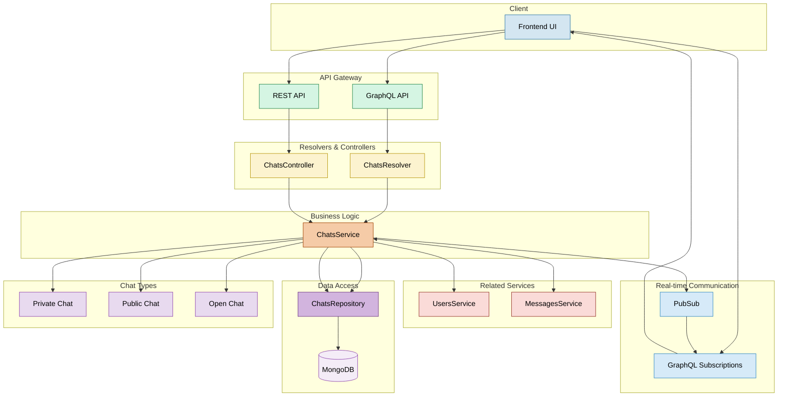

# Chats Module Documentation

## Overview

The Chats module in Apollo Chat provides comprehensive chat management functionality including:

- Chat creation and discovery
- Public and private chat types
- Member management
- Chat pinning
- Real-time chat updates
- Integration with the Messages module

This document provides a detailed overview of the Chats module's architecture, components, and API endpoints.

## Architecture

The Chats module follows a modular design with clear separation of concerns:



## Core Components

### Chat Entity (`chat.entity.ts`)

GraphQL entity representing a chat conversation:

```typescript
@ObjectType()
export class Chat extends AbstractEntity {
  @Field({ nullable: true })
  name: string;

  @Field(() => Message, { nullable: true })
  latestMessage?: Message;

  @Field(() => String)
  type: string;

  @Field(() => [User])
  members: User[];

  @Field(() => User, { nullable: true })
  creator: User;

  @Field(() => Boolean, { defaultValue: false })
  isPinned: boolean;
}
```

### Chat Document (`chat.document.ts`)

MongoDB document schema for chat conversations:

```typescript
@Schema()
export class ChatDocument extends AbstractEntity {
  @Prop()
  creatorId: string;

  @Prop()
  name: string;

  @Prop({
    type: String,
    enum: ["private", "public", "open"],
    default: "private",
  })
  type: string;

  @Prop([MessageDocument])
  messages: MessageDocument[];

  @Prop([{ type: Types.ObjectId, ref: "UserDocument" }])
  members: Types.ObjectId[];

  @Prop({ type: Map, of: Boolean, default: {} })
  pinnedBy: Map<string, boolean>;

  @Prop({ type: Object, default: {} })
  bannedUsers: Record<string, { until: Date | null; reason: string }>;
}
```

### Chats Service (`chats.service.ts`)

Provides core business logic for chat operations:

```typescript
@Injectable()
export class ChatsService {
  // Create a new chat
  async create(createChatInput: CreateChatInput, userId: string): Promise<Chat>;

  // Find multiple chats with filtering and pagination
  async findMany(
    prePipeLineStages: PipelineStage[] = [],
    paginationArgs?: PaginationArgs,
    userId?: string
  ): Promise<Chat[]>;

  // Find a single chat by ID
  async findOne(_id: string, userId?: string): Promise<Chat>;

  // Join a public or open chat
  async joinChat(chatId: string, userId: string): Promise<Chat>;

  // Add a member to a chat
  async addMember(
    chatMemberInput: ChatMemberInput,
    currentUserId: string
  ): Promise<Chat>;

  // Remove a member from a chat
  async removeMember(
    chatMemberInput: ChatMemberInput,
    currentUserId: string
  ): Promise<Chat>;

  // Update a chat's visibility type
  async updateChatType(
    chatTypeInput: ChatTypeInput,
    currentUserId: string
  ): Promise<Chat>;

  // Pin a chat for a specific user
  async pinChat(chatId: string, userId: string): Promise<Chat>;

  // Unpin a chat for a specific user
  async unpinChat(chatId: string, userId: string): Promise<Chat>;

  // Update a chat's name
  async update(updateChatInput: UpdateChatInput, userId: string): Promise<Chat>;

  // Delete a chat
  async remove(chatId: string, userId: string): Promise<Chat>;

  // Count total chats in the system
  async countChats();

  // Find public chats for discovery
  async findPublicChats(userId?: string): Promise<Chat[]>;

  // Ban a user from a chat
  async banUser(
    chatBanInput: ChatBanInput,
    currentUserId: string
  ): Promise<Chat>;

  // Unban a user from a chat
  async unbanUser(
    chatUnbanInput: ChatUnbanInput,
    currentUserId: string
  ): Promise<Chat>;

  // Get banned users for a chat
  async getBannedUsers(
    chatId: string,
    currentUserId: string
  ): Promise<BannedUser[]>;
}
```

### Chats Repository (`chats.repository.ts`)

Extends AbstractRepository to provide MongoDB operations for Chat entities:

```typescript
@Injectable()
export class ChatsRepository extends AbstractRepository<ChatDocument> {
  protected readonly logger: Logger = new Logger(ChatsRepository.name);

  constructor(@InjectModel(Chat.name) chatModel: Model<ChatDocument>) {
    super(chatModel);
  }
}
```

### Chats Resolver (`chats.resolver.ts`)

GraphQL resolver for chat operations:

```typescript
@Resolver(() => Chat)
export class ChatsResolver {
  // Create a new chat
  @Mutation(() => Chat)
  async createChat(
    @Args('createChatInput') createChatInput: CreateChatInput,
    @CurrentUser() user: TokenPayload,
  ): Promise<Chat>

  // Get paginated chats for current user
  @Query(() => [Chat], { name: 'chats' })
  async findAll(
    @Args() paginationArgs: PaginationArgs,
    @CurrentUser() user: TokenPayload,
  ): Promise<Chat[]>

  // Get public chats for discovery
  @Query(() => [Chat], { name: 'publicChats' })
  async findPublicChats(@CurrentUser() user: TokenPayload): Promise<Chat[]>

  // Get a single chat by ID
  @Query(() => Chat, { name: 'chat' })
  async findOne(
    @Args('_id') id: string,
    @CurrentUser() user: TokenPayload,
  ): Promise<Chat>

  // Join a public/open chat
  @Mutation(() => Chat)
  async joinChat(
    @Args('chatId') chatId: string,
    @CurrentUser() user: TokenPayload,
  ): Promise<Chat>

  // Add a member to a chat
  @Mutation(() => Chat)
  async addChatMember(
    @Args('chatMemberInput') chatMemberInput: ChatMemberInput,
    @CurrentUser() user: TokenPayload,
  ): Promise<Chat>

  // Remove a member from a chat
  @Mutation(() => Chat)
  async removeChatMember(
    @Args('chatMemberInput') chatMemberInput: ChatMemberInput,
    @CurrentUser() user: TokenPayload,
  ): Promise<Chat>

  // Update a chat's type
  @Mutation(() => Chat)
  async updateChatType(
    @Args('chatTypeInput') chatTypeInput: ChatTypeInput,
    @CurrentUser() user: TokenPayload,
  ): Promise<Chat>

  // Pin a chat
  @Mutation(() => Chat)
  async pinChat(
    @Args('chatPinInput') chatPinInput: ChatPinInput,
    @CurrentUser() user: TokenPayload,
  ): Promise<Chat>

  // Unpin a chat
  @Mutation(() => Chat)
  async unpinChat(
    @Args('chatPinInput') chatPinInput: ChatPinInput,
    @CurrentUser() user: TokenPayload,
  ): Promise<Chat>

  // Update a chat's name
  @Mutation(() => Chat)
  async updateChat(
    @Args('updateChatInput') updateChatInput: UpdateChatInput,
    @CurrentUser() user: TokenPayload,
  ): Promise<Chat>

  // Delete a chat
  @Mutation(() => Chat)
  async removeChat(
    @Args('chatId') chatId: string,
    @CurrentUser() user: TokenPayload,
  ): Promise<Chat>

  // Subscribe to new chat creation
  @Subscription(() => Chat)
  chatAdded()

  // Subscribe to chat deletion
  @Subscription(() => Chat)
  chatDeleted()
}
```

### Chats Controller (`chats.controller.ts`)

REST controller for chat operations:

```typescript
@Controller('chats')
export class ChatsController {
  // Count total chats in the system
  @Get('count')
  @UseGuards(JwtAuthGuard)
  async countChats()
}
```

## Chat Types and Visibility

The module supports three chat visibility types:

1. **Private Chats**

   - Default type
   - Only visible to members
   - Members must be added by the creator
   - Not discoverable in public listings

2. **Public Chats**

   - Visible in public listings
   - Users can join without invitation
   - All messages visible to members

3. **Open Chats**
   - Visible in public listings
   - Users can join without invitation
   - Similar to public chats but with different UI treatment

### Current UI Implementation

While the backend fully supports three distinct chat types (private, public, and open), **the current UI implementation simplifies this to only two options for users**:

- **Private**: Only invited members can see and join
- **Public**: Visible in discovery and anyone can join instantly

In the current version, both PUBLIC and OPEN chat types behave identically in practice - users can discover and join them directly without approval. The distinction exists in the data model to support future features such as:

- Approval workflows for joining PUBLIC chats
- Different visibility settings for chat content
- Different notification settings
- Different member management permissions

This architectural decision allows for future expansion of features without requiring database schema changes.

## Chat Data Model

### Core Structure

Chats are stored as documents with embedded messages:

```
Chat Document
├── _id: ObjectId
├── creatorId: String (reference to User)
├── name: String
├── type: String (private/public/open)
├── members: [ObjectId] (references to Users)
├── pinnedBy: Map<String, Boolean> (user-specific pinning)
└── messages: [
      {
        _id: ObjectId,
        content: String,
        createdAt: Date,
        userId: ObjectId (reference to User)
      },
      ...
    ]
```

### Indexing

The chat schema includes an index for efficient filtering by members and type:

```typescript
ChatSchema.index({ members: 1, type: 1 });
```

## Chat Aggregation Pipeline

The module uses MongoDB's aggregation pipeline for efficient chat retrieval:

1. Match chats based on access control
2. Apply any pre-pipeline stages
3. Add the latest message from the messages array
4. Calculate isPinned flag based on user-specific pinning
5. Sort by pinned status and latest message timestamp
6. Apply pagination if needed
7. Lookup related user data for members and creator
8. Process and transform the results into Chat entities

## Member Management

### Adding Members

- Chat creators can add members to any chat
- For public/open chats, any user can add members
- Members are stored as ObjectId references to User documents

### Removing Members

- Chat creators can remove any member
- Users can remove themselves from any chat
- Special handling for self-removal to return data before access is lost

### Joining Public Chats

- Users can join public/open chats without invitation
- Private chats require explicit member addition by the creator

## Chat Pinning

The module provides user-specific chat pinning:

- Pinned chats appear at the top of a user's chat list
- Pinning status is stored in a Map with user IDs as keys
- Each user can have their own set of pinned chats
- Pinning doesn't affect other users' views

## Real-time Updates

The module uses GraphQL subscriptions for real-time updates:

1. **Chat Added**

   - Triggered when a new chat is created
   - Payload contains the full chat entity

2. **Chat Deleted**
   - Triggered when a chat is deleted
   - Payload contains the deleted chat entity

## API Endpoints

### REST Endpoints

| Method | Endpoint       | Description | Guards       | Query Params | Response            |
| ------ | -------------- | ----------- | ------------ | ------------ | ------------------- |
| GET    | `/chats/count` | Count chats | JwtAuthGuard | None         | `{ count: number }` |

### GraphQL Operations

| Type         | Name               | Description             | Guards       | Variables/Args    | Return Type |
| ------------ | ------------------ | ----------------------- | ------------ | ----------------- | ----------- |
| Query        | `chats`            | Get user's chats        | GqlAuthGuard | `skip, limit`     | [Chat]      |
| Query        | `publicChats`      | Get discoverable chats  | GqlAuthGuard | None              | [Chat]      |
| Query        | `chat`             | Get chat by ID          | GqlAuthGuard | `_id: String`     | Chat        |
| Mutation     | `createChat`       | Create a new chat       | GqlAuthGuard | `CreateChatInput` | Chat        |
| Mutation     | `joinChat`         | Join a public chat      | GqlAuthGuard | `chatId: String`  | Chat        |
| Mutation     | `addChatMember`    | Add member to chat      | GqlAuthGuard | `ChatMemberInput` | Chat        |
| Mutation     | `removeChatMember` | Remove member from chat | GqlAuthGuard | `ChatMemberInput` | Chat        |
| Mutation     | `updateChatType`   | Change chat visibility  | GqlAuthGuard | `ChatTypeInput`   | Chat        |
| Mutation     | `pinChat`          | Pin a chat              | GqlAuthGuard | `ChatPinInput`    | Chat        |
| Mutation     | `unpinChat`        | Unpin a chat            | GqlAuthGuard | `ChatPinInput`    | Chat        |
| Mutation     | `updateChat`       | Update chat name        | GqlAuthGuard | `UpdateChatInput` | Chat        |
| Mutation     | `removeChat`       | Delete a chat           | GqlAuthGuard | `chatId: String`  | Chat        |
| Subscription | `chatAdded`        | New chat created        | GqlAuthGuard | None              | Chat        |
| Subscription | `chatDeleted`      | Chat deleted            | GqlAuthGuard | None              | Chat        |

## Usage Examples

### Creating a Chat

```graphql
mutation {
  createChat(
    createChatInput: {
      name: "Team Discussion"
      type: "private"
      memberIds: ["60d5ec9af682d37e6c1f4a1b", "60d5ec9af682d37e6c1f4a1c"]
    }
  ) {
    _id
    name
    type
    members {
      _id
      username
    }
    creator {
      _id
      username
    }
  }
}
```

### Retrieving User's Chats

```graphql
query {
  chats(skip: 0, limit: 10) {
    _id
    name
    type
    isPinned
    latestMessage {
      content
      createdAt
      user {
        username
      }
    }
    members {
      _id
      username
      status
    }
  }
}
```

### Joining a Public Chat

```graphql
mutation {
  joinChat(chatId: "60d5ec9af682d37e6c1f4a1b") {
    _id
    name
    members {
      _id
      username
    }
  }
}
```

### Pinning a Chat

```graphql
mutation {
  pinChat(chatPinInput: { chatId: "60d5ec9af682d37e6c1f4a1b" }) {
    _id
    name
    isPinned
  }
}
```

### Subscribing to New Chats

```graphql
subscription {
  chatAdded {
    _id
    name
    type
    creator {
      _id
      username
    }
  }
}
```

## Security Measures

- All chat operations require authentication
- Access control based on membership and chat type
- Only creators can:
  - Delete chats
  - Update chat names
  - Change chat types
  - Remove members (other than self-removal)
- Member validation for private chats
- Proper error handling with descriptive messages

## Performance Considerations

- Efficient MongoDB indexing for common queries
- Aggregation pipeline for optimized data retrieval
- Embedded messages for reduced query complexity
- User-specific pinning with Map data structure
- Pagination for large chat lists

## Chat Ban System

The Chat Ban System allows chat creators to ban users with configurable durations.

### Ban Duration Options

```typescript
export enum BanDuration {
  OneDay = "1day", // 24 hours
  OneWeek = "1week", // 7 days
  OneMonth = "1month", // 30 days
  Permanent = "permanent", // No expiration
}
```

### BannedUser Entity

```typescript
@ObjectType()
export class BannedUser {
  @Field(() => User)
  user: User;

  @Field(() => Date, { nullable: true })
  until: Date | null; // null for permanent bans

  @Field()
  reason: string;
}
```

### Ban System Features

1. **User Banning**: Chat creators can ban members with a specified duration and reason
2. **Automatic Member Removal**: Banned users are automatically removed from the chat's member list
3. **Rejoin Prevention**: Banned users cannot rejoin the chat until their ban expires or they are unbanned
4. **Ban Expiration**: Temporary bans automatically expire after their duration
5. **Ban Management**: Chat creators can view and manage banned users
