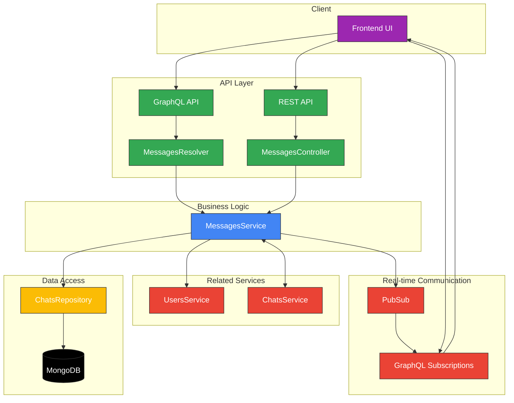

# Messages Module Documentation

## Overview

The Messages module in Apollo Chat provides real-time messaging functionality with features including:

- Message creation and retrieval
- Paginated message history
- Real-time message updates via GraphQL subscriptions
- Message counting
- User attribution for messages

This document provides a detailed overview of the Messages module's architecture, components, and API endpoints.

## Architecture

The Messages module follows a modular design with clear separation of concerns:



## Core Components

### Message Entity (`message.entity.ts`)

The Message entity represents the core data structure for messages in the system. It's defined as a GraphQL object type that clients can query:

```typescript
@ObjectType()
export class Message extends AbstractEntity {
  @Field()
  content: string;

  @Field()
  createdAt: Date;

  @Field(() => User)
  user: User;

  @Field()
  chatId: string;
}
```

This entity includes essential message properties like content, creation timestamp, the associated user, and which chat it belongs to.

### Message Document (`message.document.ts`)

While the Message entity is used for GraphQL operations, the MessageDocument defines how messages are stored in MongoDB:

```typescript
@Schema()
export class MessageDocument extends AbstractEntity {
  @Prop()
  content: string;

  @Prop()
  createdAt: Date;

  @Prop()
  userId: Types.ObjectId;
}
```

Messages are stored as embedded documents within chat documents, which optimizes retrieval performance and maintains message context.

### Messages Service (`messages.service.ts`)

The MessagesService provides the core business logic for all message-related operations:

```typescript
@Injectable()
export class MessagesService {
  // Create a new message in a chat
  async createMessage(
    { content, chatId }: CreateMessageInput,
    userId: string
  ): Promise<Message>;

  // Retrieve paginated messages from a chat
  async getMessages({
    chatId,
    skip,
    limit,
  }: GetMessagesArgs): Promise<Message[]>;

  // Count messages in a chat
  async countMessages(chatId: string): Promise<{ messages: number }>;

  // Create subscription for real-time message updates
  messageCreated();
}
```

This service handles message creation, retrieval with pagination, message counting, and manages real-time subscriptions.

### Messages Resolver (`messages.resolver.ts`)

The GraphQL resolver exposes message operations to API consumers:

```typescript
@Resolver(() => Message)
export class MessagesResolver {
  // Create a new message
  @Mutation(() => Message)
  @UseGuards(GqlAuthGuard)
  async createMessage(
    @Args('createMessageInput') createMessageInput: CreateMessageInput,
    @CurrentUser() user: TokenPayload,
  ): Promise<Message>

  // Get paginated messages
  @Query(() => [Message], { name: 'messages' })
  @UseGuards(GqlAuthGuard)
  async getMessages(
    @Args() getMessageArgs: GetMessagesArgs,
    @CurrentUser() _user: TokenPayload,
  ): Promise<Message[]>

  // Subscribe to new messages
  @Subscription(() => Message)
  messageCreated(@Args() args: MessageCreatedArgs)
}
```

This resolver provides GraphQL mutations for creating messages, queries for retrieving message history, and subscriptions for real-time updates.

### Messages Controller (`messages.controller.ts`)

For REST API consumers, the MessagesController provides HTTP endpoints:

```typescript
@Controller('messages')
export class MessagesController {
  // Count messages in a chat
  @Get('count')
  @UseGuards(JwtAuthGuard)
  async countMessages(@Query('chatId') chatId: string)
}
```

Currently, the REST API provides limited functionality compared to the GraphQL API, focusing on utility operations like message counting.

## Message Storage and Retrieval

### Data Structure

Messages are stored as embedded documents within chat documents, creating an efficient hierarchical structure:

```
Chat Document
├── _id: ObjectId
├── name: String
├── type: String
├── members: [ObjectId] (references User documents)
└── messages: [
      {
        _id: ObjectId,
        content: String,
        createdAt: Date,
        userId: ObjectId (references User document)
      },
      ...
    ]
```

This embedded document approach provides several benefits:

- Messages are always retrieved in the context of their chat
- Reduced query complexity when fetching recent messages
- Atomic operations for message creation

### Aggregation Pipeline

The module leverages MongoDB's powerful aggregation pipeline for efficient message retrieval:

```typescript
const messages = await this.chatsRepository.model.aggregate([
  { $match: { _id: new Types.ObjectId(chatId) } },
  { $unwind: "$messages" },
  { $replaceRoot: { newRoot: "$messages" } },
  { $sort: { createdAt: -1 } },
  { $skip: skip },
  { $limit: limit },
  {
    $lookup: {
      from: "users",
      localField: "userId",
      foreignField: "_id",
      as: "user",
    },
  },
  { $unwind: "$user" },
  { $unset: "userId" },
  { $set: { chatId } },
]);
```

This pipeline performs several sophisticated operations:

1. First, it matches the specific chat by ID
2. Then it unwinds the messages array to work with individual messages
3. It replaces the root with each message document for cleaner processing
4. Messages are sorted by creation date (newest first)
5. Pagination is applied with skip/limit parameters
6. User data is looked up and joined to each message
7. Finally, the chat ID is added to each message for context

This approach provides optimized performance even with large message histories.

## Real-time Messaging

### PubSub System

Real-time messaging is implemented using GraphQL subscriptions with a PubSub system:

1. When a user creates a message, the service publishes it to the `messageCreated` channel
2. Subscribers listening to that chat receive the message immediately
3. The system includes intelligent filtering to optimize message delivery

This architecture enables real-time chat experiences with minimal latency.

### Subscription Filtering

The subscription system includes sophisticated filtering to ensure messages are delivered only to appropriate recipients:

```typescript
@Subscription(() => Message, {
  filter: (
    payload: MessageCreatedPayload,
    variables: MessageCreatedArgs,
    context: SubscriptionContext,
  ) => {
    const userId = String(context.req.user._id);
    const { messageCreated } = payload;
    const messageUserId = String(messageCreated.user._id);

    return (
      variables.chatIds.includes(messageCreated.chatId) &&
      userId !== messageUserId
    );
  },
})
```

This filtering logic:

- Ensures users only receive messages from chats they're subscribed to
- Prevents users from receiving their own messages (reducing duplicate notifications)
- Provides an additional layer of security by checking user context

## API Endpoints

### REST Endpoints

| Method | Endpoint          | Description    | Guards       | Query Params | Response          |
| ------ | ----------------- | -------------- | ------------ | ------------ | ----------------- |
| GET    | `/messages/count` | Count messages | JwtAuthGuard | `chatId`     | `{ messages: n }` |

### GraphQL Operations

| Type         | Name             | Description               | Guards       | Variables/Args          | Return Type |
| ------------ | ---------------- | ------------------------- | ------------ | ----------------------- | ----------- |
| Query        | `messages`       | Get paginated messages    | GqlAuthGuard | `chatId, skip, limit`   | [Message]   |
| Mutation     | `createMessage`  | Create a new message      | GqlAuthGuard | `{ content, chatId }`   | Message     |
| Subscription | `messageCreated` | Subscribe to new messages | GqlAuthGuard | `{ chatIds: [String] }` | Message     |

## Usage Examples

### Creating a Message

```graphql
mutation {
  createMessage(
    createMessageInput: {
      content: "Hello, world!"
      chatId: "60d5ec9af682d37e6c1f4a1b"
    }
  ) {
    _id
    content
    createdAt
    user {
      _id
      username
    }
  }
}
```

### Retrieving Messages

```graphql
query {
  messages(chatId: "60d5ec9af682d37e6c1f4a1b", skip: 0, limit: 20) {
    _id
    content
    createdAt
    user {
      _id
      username
      imageUrl
      status
    }
  }
}
```

### Subscribing to Messages

```graphql
subscription {
  messageCreated(chatIds: ["60d5ec9af682d37e6c1f4a1b"]) {
    _id
    content
    createdAt
    user {
      _id
      username
      imageUrl
    }
    chatId
  }
}
```

## Security Measures

The Messages module implements several important security features:

- All message operations require authentication through guards
- Message creation validates chat membership to prevent unauthorized posting
- Subscription filtering prevents message leakage across chats
- Users only receive messages from chats they're members of
- Users don't receive their own messages via subscriptions to prevent duplication

These measures ensure that messages remain private to their intended recipients and that the system maintains proper access controls.

## Performance Considerations

The module is designed with performance in mind:

- Messages are stored as embedded documents for efficient retrieval
- Pagination prevents loading excessive messages in high-volume chats
- MongoDB aggregation pipeline optimizes complex queries for speed
- Subscription filtering reduces unnecessary network traffic
- The architecture supports horizontal scaling for high-volume deployments

These optimizations ensure the messaging system remains responsive even under heavy load.
