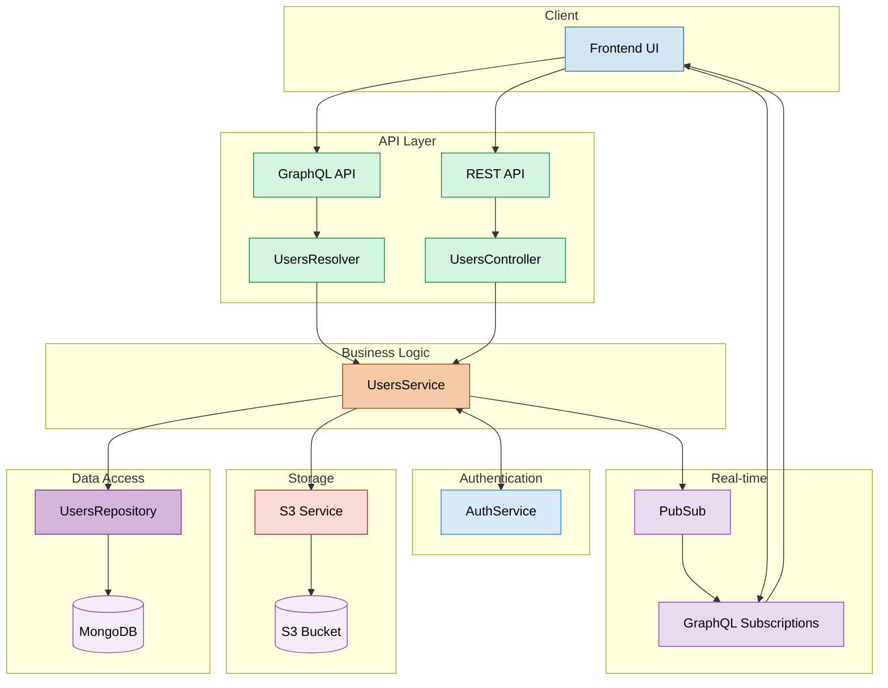

# Users Module Documentation

## Overview

The Users module in Apollo Chat provides comprehensive user management functionality including:

- User registration and profile management
- User status tracking (online/offline/away/do not disturb)
- Profile image upload and management
- User search functionality
- Real-time user presence tracking
- User authentication verification

This document provides a detailed overview of the Users module's architecture, components, and API endpoints.

## Architecture

The Users module follows a modular design with clear separation of concerns:



## Core Components

### User Entity (`user.entity.ts`)

Defines the core User model with essential user properties:

```typescript
@ObjectType()
export class User extends AbstractEntity {
  @Field()
  email: string;

  @Field()
  username: string;

  @Field({ nullable: true })
  imageUrl: string;

  @Field(() => UserStatus, { defaultValue: UserStatus.OFFLINE })
  status: UserStatus;
}
```

### User Status (`user-status.enum.ts`)

Defines the possible user status values:

```typescript
export enum UserStatus {
  ONLINE = "ONLINE",
  AWAY = "AWAY",
  DND = "DND",
  OFFLINE = "OFFLINE",
}
```

### Users Service (`users.service.ts`)

Provides core business logic for user management:

- User creation and authentication
- Profile management
- Status tracking
- Connection management
- User search

Key methods include:

```typescript
// User creation with password hashing
async create(createUserInput: CreateUserInput)

// User authentication
async verifyUser(email: string, password: string)

// Profile image upload
async uploadImage(file: Buffer, userId: string)

// Status management
async updateStatus(userId: string, status: UserStatus)

// Password management
async updatePassword(userId: string, newPassword: string)

// Connection tracking for presence
async trackConnection(userId: string)
async trackDisconnection(userId: string)

// User search
async searchByEmail(searchTerm: string, currentUserId?: string, limit = 10)

// OAuth integration
async findOrCreateGoogleUser(googleUserData: {...})
```

### Users Repository (`users.repository.ts`)

Extends the AbstractRepository to provide MongoDB operations for User entities.

### Users Controller (`users.controller.ts`)

Provides REST endpoints for user operations:

```typescript
@Controller('users')
export class UsersController {
  // Upload profile picture
  @Post('image')
  @UseGuards(JwtAuthGuard)
  @UseInterceptors(FileInterceptor('file'))
  async uploadProfilePicture(...)
}
```

### Users Resolver (`users.resolver.ts`)

Provides GraphQL operations for user management:

```typescript
@Resolver(() => User)
export class UsersResolver {
  // Query current user
  @Query(() => User, { name: 'me' })

  // Query user by ID
  @Query(() => User, { name: 'user' })

  // Search users by email
  @Query(() => [User], { name: 'searchUsers' })

  // Update user status
  @Mutation(() => User)
  async updateUserStatus(...)

  // Subscribe to user status changes
  @Subscription(() => User)
  userStatusChanged(...)
}
```

## User Status Management

The Users module implements a sophisticated presence system that:

1. Tracks WebSocket connections per user
2. Automatically updates status based on connection count
3. Allows manual status setting (AWAY, DND)
4. Broadcasts status changes in real-time via GraphQL subscriptions

### Connection Tracking Logic

```
When a user connects:
  - Increment connection count
  - If first connection, update status to ONLINE (unless manually set to AWAY/DND)
  - Broadcast status change

When a user disconnects:
  - Decrement connection count
  - If no connections remain, update status to OFFLINE
  - Broadcast status change
```

## User Search

The module provides email-based user search with:

- Partial matching (case-insensitive)
- Exclusion of current user from results
- Configurable result limits
- MongoDB text index optimization

## API Endpoints

### REST Endpoints

| Method | Endpoint       | Description            | Guards       | Request Body | Response      |
| ------ | -------------- | ---------------------- | ------------ | ------------ | ------------- |
| POST   | `/users/image` | Upload profile picture | JwtAuthGuard | Image file   | Upload result |

### GraphQL Operations

| Type         | Name                | Description               | Guards       | Variables                        | Return Type |
| ------------ | ------------------- | ------------------------- | ------------ | -------------------------------- | ----------- |
| Query        | `me`                | Gets current user         | GqlAuthGuard | None                             | User        |
| Query        | `user`              | Gets user by ID           | GqlAuthGuard | `id: String`                     | User        |
| Query        | `searchUsers`       | Searches users by email   | GqlAuthGuard | `searchTerm: String, limit: Int` | [User]      |
| Mutation     | `updateStatus`      | Updates user status       | GqlAuthGuard | `status: UserStatus`             | User        |
| Subscription | `userStatusChanged` | User status change events | GqlAuthGuard | `userIds: [String]`              | User        |

## OAuth Integration

The Users module supports Google OAuth authentication:

- Integration with the Auth module for OAuth flows
- Automatic user creation for new OAuth users
- Linking existing accounts with OAuth profiles
- Profile image import from OAuth provider

## Image Storage

User profile images are stored in S3-compatible storage:

- Images are stored in a dedicated bucket defined by `USERS_BUCKET` constant
- File naming follows a consistent pattern: `{userId}.{USERS_IMAGE_FILE_EXTENSION}`
- Image URLs are generated dynamically based on bucket and key
- Image size is limited to 100KB
- Only JPEG format is accepted

## Security Measures

- Passwords are hashed using bcrypt with a salt factor of 10
- Profile updates require JWT authentication
- Email verification is required before login
- User search is limited to authenticated users
- Connection tracking prevents status spoofing

## Usage Examples

### Uploading a Profile Image

```typescript
// Frontend code example
const uploadProfileImage = async (file) => {
  const formData = new FormData();
  formData.append("file", file);

  await fetch("/users/image", {
    method: "POST",
    body: formData,
    credentials: "include", // For cookies/authentication
  });
};
```

### Updating User Status (GraphQL)

```typescript
// GraphQL mutation
const UPDATE_STATUS = gql`
  mutation UpdateStatus($status: UserStatus!) {
    updateStatus(status: $status) {
      _id
      username
      status
    }
  }
`;

// Usage
const [updateStatus] = useMutation(UPDATE_STATUS);
updateStatus({ variables: { status: "AWAY" } });
```

### Subscribing to Status Changes (GraphQL)

```typescript
// GraphQL subscription
const USER_STATUS_CHANGED = gql`
  subscription UserStatusChanged {
    userStatusChanged {
      _id
      username
      status
    }
  }
`;

// Usage
const { data } = useSubscription(USER_STATUS_CHANGED);
```
