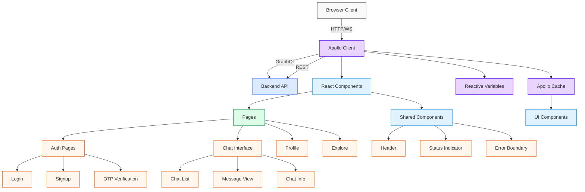
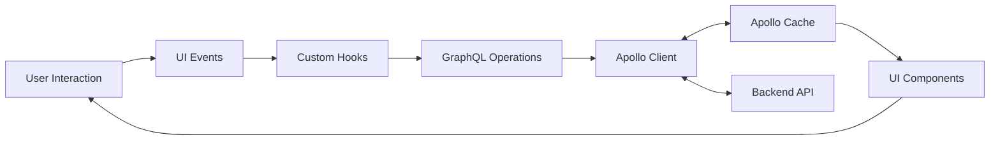

# Apollo Chat Frontend Architecture

## System Overview

Apollo Chat's frontend is a modern single-page application built with React, TypeScript, and Apollo Client. The architecture follows a component-based approach with centralized state management through Apollo Client's cache, focusing on real-time updates, responsive design, and seamless user experience.

**For detailed frontend architecture and feature breakdowns, see:**

- [Caching](./caching.md) – Apollo Client cache configuration, reactive variables, and cache policies
- [Features](./features.md) – Key user-facing functionality like chat, explore, profile, and OTP flow
- [Hooks](./hooks.md) – Custom React hooks for encapsulating logic and improving reusability
- [Lifecycle & Effects](./lifecycle-and-effect.md) – Effect cleanup, real-time subscriptions, and visibility tracking
- [Infrastructure > Deployment](./infra/deployment.md) – Vercel, CI/CD, environment management
- [Infrastructure > Security](./infra/security.md) – Input sanitization, session handling, and route guards

## Tech Stack

| Layer            | Technology                                      | Purpose                                |
| ---------------- | ----------------------------------------------- | -------------------------------------- |
| Language         | TypeScript                                      | Type safety and developer experience   |
| Framework        | [React](https://reactjs.org/) 18                | Component-based UI development         |
| State Management | [Apollo Client](https://www.apollographql.com/) | GraphQL client and state management    |
| UI Components    | [Material UI](https://mui.com/) 5               | Design system and component library    |
| Routing          | React Router 7                                  | Client-side routing                    |
| API Layer        | GraphQL (Apollo Client), REST (Fetch API)       | Data fetching and mutations            |
| Realtime Updates | GraphQL Subscriptions (graphql-ws)              | Real-time data synchronization         |
| Type Generation  | GraphQL Code Generator                          | Automatic TypeScript types from schema |
| Date Handling    | date-fns                                        | Date formatting and manipulation       |
| Animations       | Framer Motion                                   | UI animations and transitions          |
| Storage          | LocalStorage, HTTP-only Cookies                 | Client-side storage and authentication |

## Component Architecture Diagram

This diagram illustrates the frontend architecture, showing how Apollo Client serves as the central hub connecting the React component tree with the backend API.

The diagram above illustrates the frontend architecture, showing how Apollo Client serves as the central hub connecting the React component tree with the backend API. The cache system provides reactive data management, while components are organized into pages and shared elements.

## Data Flow Architecture

This diagram visualizes how data flows through the frontend application, from user interactions to API calls and back to the UI.

## Core Architectural Principles

1. **Component-Based Design**: UI is composed of reusable, isolated components
2. **Centralized State Management**: Apollo Client cache serves as the single source of truth
3. **Declarative Data Fetching**: GraphQL queries define exact data requirements
4. **Reactive Updates**: Real-time data with GraphQL subscriptions
5. **Type Safety**: End-to-end type safety with TypeScript and generated types
6. **Separation of Concerns**: Clear boundaries between UI, data fetching, and business logic

## Feature Modules

### Authentication Module

Handles user authentication and account management:

- **Multiple Auth Methods**: Email/password login and Google OAuth
- **Token Management**: HTTP-only cookies for secure authentication
- **Session Handling**: Auto-refresh of expired tokens
- **Demo User Support**: Special handling for demo accounts

For detailed information about the authentication implementation, see the [security documentation](../infra/security.md).

### Chat Module

Manages chat conversations and messages:

- **Chat Types**: Support for private, public, and open chat rooms
- **Real-time Updates**: Live message delivery via subscriptions
- **Infinite Scrolling**: Efficient message pagination
- **Chat Management**: Create, join, and manage chat rooms

For detailed information about chat functionality, see the [features documentation](./features.md) and [caching architecture](./caching.md).

### User Module

Handles user profiles and status:

- **Profile Management**: View and edit user profiles
- **Status Updates**: Real-time user status indicators
- **User Search**: Find and connect with other users
- **Image Uploads**: Profile picture management

For detailed information about user features, see the [features documentation](./features.md).

### Explore Module

Provides discovery of public chats:

- **Public Chat Listing**: Browse available public chat rooms
- **Join Functionality**: Easy access to join public conversations

## Component Architecture

Each feature module follows a consistent structure:

- **Container Components**: Handle data fetching and business logic
- **Presentation Components**: Focus on UI rendering
- **Custom Hooks**: Encapsulate data operations and side effects
- **Utility Functions**: Provide reusable helper methods

For detailed information about component organization and patterns, see the [features documentation](./features.md).

## State Management

Apollo Chat uses a hybrid state management approach:

1. **Apollo Client Cache**: Primary state store for all server-derived data
2. **Reactive Variables**: Local state management for UI-specific state
3. **React Component State**: Local component state for UI interactions

### Apollo Client Configuration

Apollo Client serves as the central data management layer:

- **HTTP Link**: For GraphQL queries and mutations with cookie credentials
- **WebSocket Link**: For GraphQL subscriptions with token authentication
- **Error Link**: For handling authentication errors and token refresh
- **InMemoryCache**: For client-side data caching with custom merge functions

For detailed information about Apollo Client configuration and caching strategies, see the [caching documentation](./caching.md).

## Custom Hooks Architecture

Apollo Chat implements a comprehensive suite of custom React hooks that encapsulate the application's core functionality:

1. **Data Fetching Hooks**: Retrieve data from the server via GraphQL queries
2. **Data Mutation Hooks**: Modify data on the server via GraphQL mutations
3. **Subscription Hooks**: Manage real-time data via GraphQL subscriptions
4. **Authentication Hooks**: Handle user authentication flows
5. **Utility Hooks**: Provide helper functionality for components

Each hook is designed to be self-contained, reusable, and focused on a specific task, following React's composition model.

For detailed information about custom hooks implementation, see the [hooks documentation](./hooks.md).

## Lifecycle and Effect Management

Apollo Chat implements careful management of component lifecycles and side effects, especially for GraphQL subscriptions. This ensures:

1. **Memory Efficiency**: All resources are properly cleaned up when no longer needed
2. **Consistent UI**: UI stays in sync with data changes
3. **Performance**: Prevents memory leaks and unnecessary re-renders

For detailed information on lifecycle and effect management, see the [lifecycle & effect management documentation](./lifecycle-and-effect.md).

## UI Architecture

### Theme System

Material UI provides the theming foundation:

- **Custom Palette**: Brand colors with dark mode optimization
- **Typography System**: Consistent text styling across the application
- **Component Overrides**: Custom styling for MUI components
- **Responsive Design**: Breakpoint-based adaptations for different devices

### Responsive Design

The UI adapts to different screen sizes:

- **Mobile-First Approach**: Designed for mobile with progressive enhancement
- **Responsive Grid**: Flexible layout using MUI Grid system
- **Conditional Rendering**: Different components for mobile and desktop
- **Touch Optimization**: Larger touch targets and mobile-friendly interactions

## Performance Optimizations

1. **Memoization**: React.memo and useMemo to prevent unnecessary re-renders
2. **Code Splitting**: Lazy loading of components for faster initial load
3. **Cache Normalization**: Efficient data storage and updates
4. **Optimistic UI**: Immediate feedback before server confirmation
5. **Virtualization**: Efficient rendering of large lists
6. **Subscription Management**: Proper cleanup to prevent memory leaks

## Testing Strategy

Apollo Chat implements a comprehensive testing strategy:

- **Unit Testing**: Individual components tested in isolation with React Testing Library
- **Integration Testing**: Testing interactions between components
- **Mock Service Worker**: Mocking API responses for consistent testing
- **Storybook**: Component documentation and visual testing
- **End-to-End Testing**: Cross-browser testing with Cypress

Testing documentation will be released when it's completed.

## Future Considerations

1. **Progressive Web App**: Service workers for offline support and improved performance
2. **Advanced Caching Strategies**: More sophisticated cache policies for different data types
3. **Micro-Frontend Architecture**: Potential evolution to micro-frontend architecture
4. **Server Components**: Adoption of React Server Components when mature
5. **Internationalization**: Multi-language support
