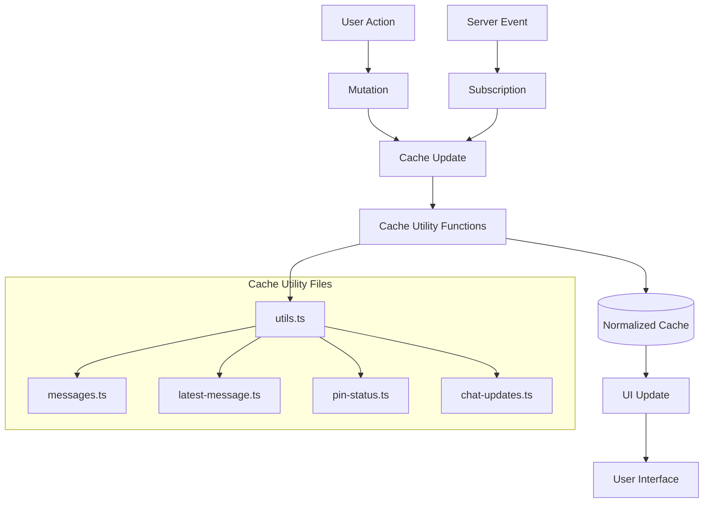

# Apollo Chat Frontend Caching Architecture

## Overview

Apollo Chat implements a sophisticated caching strategy using Apollo Client's InMemoryCache. This system enables real-time updates, optimistic UI responses, and efficient data management throughout the application.

In a real-time chat application like Apollo Chat, effective caching is critical for performance and user experience. Without proper caching, the application would need to constantly re-fetch data from the server, causing latency, network overhead, and a sluggish interface. The caching strategy implemented here ensures messages appear instantly for senders, historical messages load quickly when switching chats, and real-time updates blend seamlessly with cached data. This creates a responsive, fluid experience that feels native rather than web-based.

## Cache Configuration

The cache is configured in `src/constants/apollo-client.ts` with custom type policies for handling data merging and normalization:

```javascript
const client = new ApolloClient({
  cache: new InMemoryCache({
    typePolicies: {
      Query: {
        fields: {
          chats: {
            keyArgs: false,
            merge(_, incoming) {
              // Simplified merge logic - just sort the incoming chats
              return sortChats(incoming);
            },
          },
          messages: {
            keyArgs: ["chatId"],
            merge(existing, incoming, { args }) {
              const merged = existing ? existing.slice(0) : [];
              if (args?.skip !== undefined) {
                for (let i = 0; i < incoming.length; ++i) {
                  merged[args.skip + i] = incoming[i];
                }
                return merged;
              }
              return incoming;
            },
          },
        },
      },
      User: {
        fields: {
          status: {
            // Always use the latest status value from the server
            merge: (_, incoming) => incoming,
          },
        },
      },
    },
  }),
  link: debugLink.concat(errorLink.concat(splitLink)),
});
```

## Cache Update Mechanisms



### 1. Subscription-Based Updates

Real-time data is handled through GraphQL subscriptions that update the cache when server events occur:

- **Message Subscriptions**: When new messages are created, the cache is updated to include them
- **Chat Subscriptions**: When chats are added or deleted, the cache reflects these changes
- **User Status Subscriptions**: When users change status, the cache is automatically updated

### 2. Mutation-Based Updates

After mutations, the cache is directly modified to reflect changes:

- **Message Creation**: Adds new messages to the cache
- **Chat Pinning**: Updates the pin status and re-sorts the chat list
- **Chat Management**: Handles adding, updating, and removing chats

## Core Cache Utility Files

The application organizes cache operations into specialized utility files:

| File                | Purpose                                  |
| ------------------- | ---------------------------------------- |
| `utils.ts`          | Core read/write operations for the cache |
| `messages.ts`       | Message-specific cache operations        |
| `latest-message.ts` | Updates latest message in chat lists     |
| `pin-status.ts`     | Handles pinning/unpinning chats          |
| `chat-updates.ts`   | Manages chat additions and deletions     |

### Key Utility Functions

```javascript
// Reading chats from cache
export const readChatsFromCache = (
  cache: ApolloCache<any>
): Chat[] | undefined => {
  try {
    const queryResult = cache.readQuery({
      query: getChatsDocument,
    });
    return queryResult?.chats;
  } catch (error) {
    console.error("Error reading chats from cache:", error);
    return undefined;
  }
};

// Writing sorted chats to cache
export const writeSortedChatsToCache = (
  cache: ApolloCache<any>,
  updatedChats: Chat[]
) => {
  try {
    // Sort chats to maintain proper order with pinned chats first
    const sortedChats = sortChats(updatedChats);

    // Write the sorted chats back to the cache without pagination parameters
    cache.writeQuery({
      query: getChatsDocument,
      data: {
        chats: sortedChats,
      },
    });
  } catch (error) {
    console.error("Error writing sorted chats to cache:", error);
  }
};
```

## Cache Update Patterns

### Message Updates

When a new message is received:

1. The message is added to the chat's message list
2. The chat's latest message is updated
3. Duplicate messages are prevented

```javascript
export const updateMessages = (cache: ApolloCache<any>, message: Message) => {
  try {
    const messagesQueryOptions = {
      query: getMessagesDocument,
      variables: {
        chatId: message.chatId,
        skip: 0,
        limit: PAGE_SIZE,
      },
    };

    const messagesData = cache.readQuery({ ...messagesQueryOptions });
    const existingMessages = messagesData?.messages || [];

    // Check if the message already exists in the cache
    const isDuplicate = existingMessages.some((m) => m._id === message._id);

    // Only add the message if it's not a duplicate
    if (!isDuplicate) {
      cache.writeQuery({
        ...messagesQueryOptions,
        data: {
          messages: [...existingMessages, message],
        },
      });
    }
  } catch (error) {
    console.error("Error updating messages cache:", error);
  }
};
```

### Latest Message Updates

When a new message is received, the latest message in the chat list is also updated:

```javascript
export const updateLatestMessage = (
  cache: ApolloCache<any>,
  message: Message
) => {
  try {
    // Read chats from cache
    const chats = readChatsFromCache(cache);
    if (!chats) return;

    // Find the chat to update
    const cachedChatIndex = chats.findIndex(
      (chat) => chat._id === message.chatId
    );

    if (cachedChatIndex === -1) {
      return;
    }

    // Update the latest message
    const updatedChats = [...chats];
    const cachedChat = updatedChats[cachedChatIndex];
    const cachedChatCopy = { ...cachedChat };
    cachedChatCopy.latestMessage = message;
    updatedChats[cachedChatIndex] = cachedChatCopy;

    // Write sorted chats back to cache
    writeSortedChatsToCache(cache, updatedChats);
  } catch (error) {
    console.error("Error updating latest message:", error);
  }
};
```

### Chat Updates

When chats are added or deleted:

1. The chat list is updated
2. Chats are sorted (pinned chats first, then by latest message date)
3. Public chat lists are also updated if applicable

```javascript
export const updateChatAdded = (cache: ApolloCache<any>, chat: Chat) => {
  try {
    // Read chats from cache
    const chats = readChatsFromCache(cache);
    if (!chats) return;

    // Check if chat already exists in cache
    const chatExists = chats.some((c) => c._id === chat._id);
    if (chatExists) return;

    // Add the new chat to the existing chats
    const updatedChats = [...chats, chat];

    // Write sorted chats back to cache
    writeSortedChatsToCache(cache, updatedChats);

    // Update public chats cache if this is a public or open chat
    if (chat.type === ChatType.PUBLIC || chat.type === ChatType.OPEN) {
      try {
        // Read public chats from cache
        const publicChatsData = cache.readQuery<{ publicChats: Chat[] }>({
          query: GET_PUBLIC_CHATS,
        });

        if (publicChatsData && publicChatsData.publicChats) {
          const publicChats = publicChatsData.publicChats;

          // Check if chat already exists in public chats cache
          const chatExistsInPublic = publicChats.some(
            (c: Chat) => c._id === chat._id
          );
          if (chatExistsInPublic) return;

          // Add the new chat to public chats
          cache.writeQuery({
            query: GET_PUBLIC_CHATS,
            data: {
              publicChats: [...publicChats, chat],
            },
          });
        }
      } catch (error) {
        console.error("Error updating public chats cache:", error);
      }
    }
  } catch (error) {
    console.error("Error updating chat added:", error);
  }
};
```

### Chat Sorting Logic

Chats are sorted with a consistent algorithm to maintain order in the UI:

```javascript
export const sortChats = (chats: Chat[]): Chat[] => {
  return [...chats].sort((a, b) => {
    // Sort by isPinned first (pinned chats at the top)
    if (a.isPinned && !b.isPinned) return -1;
    if (!a.isPinned && b.isPinned) return 1;

    // For chats with the same pin status, sort by latest message
    // Explicit check: chats without messages go to the bottom
    if (!a.latestMessage && b.latestMessage) return 1; // A to bottom
    if (a.latestMessage && !b.latestMessage) return -1; // B to bottom

    // If both have messages or both don't have messages
    if (!a.latestMessage && !b.latestMessage) {
      // For chats without messages, sort by ID (oldest first)
      return a._id < b._id ? -1 : 1;
    }

    // For chats with messages, newest messages first
    const timeA = new Date(a.latestMessage?.createdAt).getTime();
    const timeB = new Date(b.latestMessage?.createdAt).getTime();
    return timeB - timeA; // Newest messages at top
  });
};
```

### Pin Status Updates

When a chat is pinned or unpinned, the cache is updated to reflect the change:

```javascript
export const updateChatPinStatus = (
  cache: ApolloCache<any>,
  chatId: string,
  isPinned: boolean
) => {
  try {
    // Read chats from cache
    const chats = readChatsFromCache(cache);
    if (!chats) return;

    // Find the chat to update
    const chatIndex = chats.findIndex((chat) => chat._id === chatId);
    if (chatIndex === -1) return;

    // Update the pin status of the chat
    const updatedChats = [...chats];
    const updatedChat = { ...updatedChats[chatIndex], isPinned };
    updatedChats[chatIndex] = updatedChat;

    // Write sorted chats back to cache
    writeSortedChatsToCache(cache, updatedChats);
  } catch (error) {
    console.error("Error updating chat pin status:", error);
  }
};
```

## Message Pagination

Apollo Chat implements efficient pagination for message loading:

```javascript
// In apollo-client.ts
messages: {
  keyArgs: ["chatId"],
  merge(existing, incoming, { args }) {
    const merged = existing ? existing.slice(0) : [];
    if (args?.skip !== undefined) {
      for (let i = 0; i < incoming.length; ++i) {
        merged[args.skip + i] = incoming[i];
      }
      return merged;
    }
    return incoming;
  },
}

// In Chat.tsx
const handleLoadMore = useCallback(() => {
  if (!messages?.messages?.length || messagesLoading) return;

  if (messagesCount !== undefined && messages.messages.length >= messagesCount)
    return;

  setTimeout(() => {
    fetchMore({
      variables: {
        chatId,
        skip: messages.messages.length,
        limit: PAGE_SIZE,
      },
    }).catch((error) => {
      console.error("Error loading more messages:", error);
    });
  }, 0);
}, [messages?.messages, messagesLoading, messagesCount, fetchMore, chatId]);
```

## Error Handling and Token Refresh

The Apollo Client setup includes sophisticated error handling with token refresh:

```javascript
// Enhanced error handling with token refresh
const errorLink = onError(
  ({ graphQLErrors, networkError, operation, forward }) => {
    // Check for demo restriction errors
    const demoError = graphQLErrors?.find((error) =>
      error.message.includes("Demo account is read-only")
    );

    if (demoError) {
      // Show alert for demo restrictions
      snackVar(DEMO_ERROR_SNACK_MESSAGE);
      return forward(operation);
    }

    // Check if we have authentication errors
    const authError = graphQLErrors?.find(
      (error) =>
        error.extensions?.code === "UNAUTHENTICATED" ||
        (error.extensions?.originalError as any)?.statusCode === 401
    );

    // If on login page or other excluded routes, don't try to refresh
    if (
      excludedRoutes.some((route) => window.location.pathname.includes(route))
    ) {
      return forward(operation);
    }

    // If we have an auth error, try to refresh the token
    if (authError) {
      // Use fromPromise for token refresh
      return fromPromise(refreshAccessToken()).flatMap((success) => {
        if (success) {
          // Retry the failed request
          return forward(operation);
        } else {
          // If refresh failed, logout
          onLogout();
          return forward(operation);
        }
      });
    }

    // For non-auth errors, just pass through
    return forward(operation);
  }
);
```

## Best Practices

1. **Centralized Cache Operations**: Common operations are centralized in utility files
2. **Error Handling**: All cache operations include try/catch blocks
3. **Duplicate Prevention**: Checks prevent duplicate entries in the cache
4. **Consistent Sorting**: Chat lists maintain consistent sorting order with pinned chats first
5. **Strategic Fetch Policies**: Different queries use appropriate fetch policies
6. **TypeScript Integration**: All cache operations are properly typed

## Performance Considerations

1. **Normalized Data**: Apollo Client normalizes entities by ID
2. **Efficient Updates**: Only affected parts of the UI re-render when data changes
3. **Pagination Support**: Efficient handling of paginated message data
4. **Error Recovery**: Automatic token refresh and error handling
