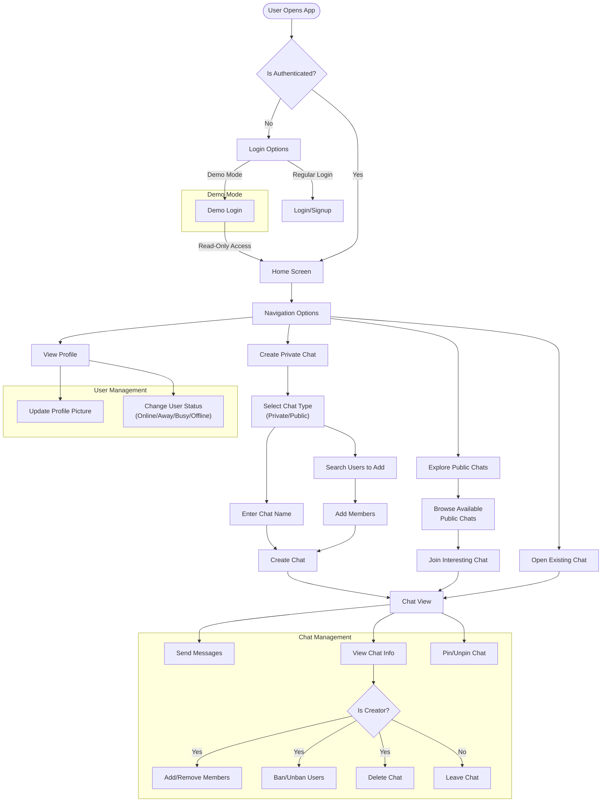

# Apollo Chat Frontend Features

## Overview

Apollo Chat's frontend is built with a rich set of interactive components that provide users with a comprehensive messaging experience. This document outlines the key features and capabilities of the main component modules, focusing on what users can do with each component and how they enhance the overall application experience.

## User Interaction Flow

## Chat Interface Components

The chat interface provides a full-featured messaging experience with real-time updates and intuitive controls.

### Key Features

1. **Message Management**

   - Real-time message delivery and reception
   - Message composition
   - Automatic scrolling to latest messages
   - Infinite scrolling for message history

2. **Chat Organization**

   - Chat pinning for important conversations
   - Chat list sorting by recency and pin status
   - Latest message previews

3. **Chat Information**

   - Member management (add/remove participants)
   - Chat settings modification (name, type)
   - Leave/delete chat options
   - Member activity visibility
   - Ban management system (ban/unban users with configurable durations)

4. **Chat Creation**
   - Multiple chat types (private, public, open)
   - Member selection from user directory
   - Custom chat naming
   - Privacy settings configuration

## User Profile Components

The user profile system allows users to manage their identity and presence within the application.

### Key Features

1. **Profile Management**

   - Profile information editing
   - Profile picture upload and management
   - Account settings configuration

2. **Status System**

   - Real-time status updates (online, away, busy, offline)
   - Status selection through dropdown interface
   - Status visibility across the application
   - Status indicator integration with avatars

3. **Avatar System**

   - Image-based avatars with upload capability
   - Fallback to name-based colored avatars
   - Multiple size options for different contexts
   - Status indicator integration

4. **User Search**
   - Find users by username or email
   - Add users to conversations
   - View user profiles
   - Connect with new contacts

## Explore Components

The explore section enables discovery of public conversations and communities.

### Key Features

1. **Public Chat Discovery**

   - Browsing available public chat rooms
   - One-click joining of interesting conversations
   - Visual indicators for chat types and member counts

2. **Community Engagement**
   - Access to topic-based discussions
   - Participation in open conversations
   - Finding like-minded users

## Navigation Components

The navigation system provides intuitive access to all application features.

### Key Features

1. **Header Navigation**

   - Access to main application sections
   - Responsive design for all screen sizes
   - User settings quick access
   - Application branding and identity

2. **Mobile Navigation**

   - Touch-optimized drawer interface
   - Compact menu for small screens
   - Seamless transition between views
   - Bottom navigation options for common actions

3. **User Settings Menu**
   - Quick access to profile settings
   - Status selection dropdown
   - Logout functionality
   - Account management options

## Common UI Components

Shared components that enhance the overall user experience across the application.

### Key Features

1. **Error Handling**

   - Graceful error recovery
   - User-friendly error messages
   - Fallback UI for failed components

2. **Notifications**

   - Toast notifications for system messages
   - Action feedback confirmations
   - Error alerts with recovery options
   - Success confirmations for user actions

3. **Loading States**

   - Progress indicators for operations
   - Optimistic UI updates for responsiveness
   - Seamless transitions between loading states

4. **Responsive Design**
   - Mobile-first approach
   - Adaptive layouts for all screen sizes
   - Touch-optimized interfaces
   - Consistent experience across devices

## Cross-Cutting Features

Features that span multiple components and enhance the overall application experience.

### Real-Time Communication

Apollo Chat provides instant communication through:

1. **Live Updates**

   - Instant message delivery
   - Real-time status changes
   - Chat membership updates

2. **Subscription Management**
   - Efficient WebSocket connections
   - Automatic reconnection handling
   - Resource-aware subscription handling
   - Optimistic UI updates

### User Presence System

The presence system keeps users informed about others' availability:

1. **Status Tracking**

   - Real-time status updates
   - Visual indicators (online, away, busy, offline)
   - Status persistence across sessions

2. **Availability Management**
   - User-controlled status settings
   - Status persistence across sessions

### File Management

Apollo Chat includes capabilities for handling user files:

1. **Image Uploads**

   - Profile picture management
   - Secure storage integration

### Accessibility Features

Apollo Chat is designed with accessibility in mind:

1. **Keyboard Navigation**

   - Focus management
   - Tab order optimization

2. **Screen Reader Support**

   - ARIA attributes
   - Semantic HTML structure
   - Alternative text for images

3. **Visual Accessibility**
   - Color choices for readability
   - Clear visual hierarchy

## User Onboarding

Apollo Chat provides a smooth introduction for new users:

1. **Welcome Tour**

   - Step-by-step feature introduction
   - Interactive guidance
   - Skip option for experienced users

## Future Enhancements

Planned features for future releases:

1. **Rich Media Support**

   - Image sharing in messages
   - File attachments
   - Audio/video messages
   - Media galleries

2. **Advanced Chat Features**

   - Message reactions
   - Thread replies
   - Message editing and deletion
   - Read receipts
   - Typing indicators

3. **Enhanced User Profiles**

   - Custom status messages
   - Extended profile information
   - User tagging and mentions
   - User groups and roles

4. **Search Capabilities**
   - Full-text message search
   - Advanced filtering options
   - Search result highlighting
   - Recent search history
