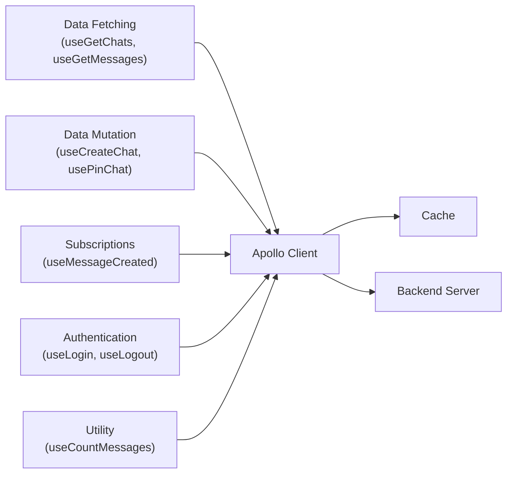
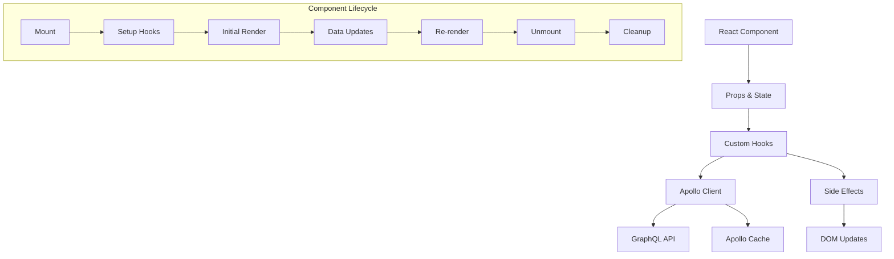

# Apollo Chat Frontend Hook Architecture

## Overview

Apollo Chat implements a comprehensive suite of custom React hooks that encapsulate the application's core functionality. These hooks provide a clean separation between UI components and data operations, making the codebase more maintainable and testable.

## Hook Categories



Apollo Chat's hooks are organized into five main categories, each serving a specific purpose in the application's data flow architecture:

1. **Data Fetching Hooks** - Retrieve data from the server via GraphQL queries
2. **Data Mutation Hooks** - Modify data on the server via GraphQL mutations
3. **Subscription Hooks** - Manage real-time data via GraphQL subscriptions
4. **Authentication Hooks** - Handle user authentication flows
5. **Utility Hooks** - Provide helper functionality for components

Each hook is designed to be self-contained, reusable, and focused on a specific task, following React's composition model.

## Data Fetching Hooks

These hooks encapsulate GraphQL queries and provide a clean interface for components to access data.

### useGetChats

Fetches all chats for the current user with a large limit to effectively get all chats at once.

```typescript
const useGetChats = () => {
  const result = useQuery(getChatsDocument, {
    variables: {
      skip: 0,
      limit: FETCH_ALL_CHATS_LIMIT,
    },
    fetchPolicy: "cache-and-network",
  });

  return result;
};
```

### useGetMessages

Retrieves messages for a specific chat with pagination support and safety checks.

```typescript
const useGetMessages = (variables: MessagesQueryVariables) => {
  // Skip the query if any required variables are missing
  const skipQuery =
    !variables.chatId || variables.skip === undefined || !variables.limit;

  const result = useQuery(getMessagesDocument, {
    variables,
    skip: skipQuery,
  });

  // Add protection to fetchMore to ensure valid variables
  const safeFetchMore = (options: any) => {
    if (!options.variables)
      return Promise.reject(new Error("No variables provided"));
    // Additional validation checks...
    return result.fetchMore(options);
  };

  return {
    ...result,
    fetchMore: safeFetchMore,
  };
};
```

### useGetPublicChats

Fetches all public and open chats for the explore page.

```typescript
export const useGetPublicChats = () => {
  const { data, loading, error, refetch } = useQuery(GET_PUBLIC_CHATS, {
    fetchPolicy: "cache-and-network",
    notifyOnNetworkStatusChange: true,
  });

  return {
    publicChats: data?.publicChats || [],
    loading,
    error,
    refetch,
  };
};
```

## Data Mutation Hooks

These hooks wrap GraphQL mutations and handle cache updates.

### useCreateMessage

Creates a new message and updates the cache with the new message.

```typescript
const useCreateMessage = () => {
  return useMutation(createMessageDocument, {
    update(cache, { data }) {
      try {
        if (data?.createMessage) {
          updateMessages(cache, data.createMessage);
          updateLatestMessage(cache, data.createMessage);
        }
      } catch (error) {
        console.error("Error updating cache after message creation:", error);
      }
    },
    onError: (error) => {
      console.error("Error creating message:", error);
    },
  });
};
```

### useCreateChat

Creates a new chat with specified name, type, and members.

```typescript
export const useCreateChat = () => {
  const [createChatMutation, { loading, error }] = useMutation(CREATE_CHAT);

  const createChat = async (
    name: string,
    type: ChatType = ChatType.PRIVATE,
    memberIds: string[] = []
  ) => {
    try {
      const { data } = await createChatMutation({
        variables: {
          createChatInput: {
            name,
            type,
            memberIds,
          },
        },
      });
      return data?.createChat;
    } catch (err) {
      console.error("Error creating chat:", err);
      throw err;
    }
  };

  return {
    createChat,
    loading,
    error,
  };
};
```

### usePinChat and useUnpinChat

These hooks handle pinning and unpinning chats with optimistic UI updates.

```typescript
export const usePinChat = () => {
  const [pinChatMutation] = useMutation(PIN_CHAT);

  const pinChat = async (chatId: string) => {
    const { data } = await pinChatMutation({
      variables: {
        chatPinInput: {
          chatId,
        },
      },
      update: (cache, { data }) => {
        if (data?.pinChat) {
          // Optimistic update
          cache.modify({
            id: cache.identify(data.pinChat),
            fields: {
              isPinned: () => true,
            },
          });
        }
      },
    });
    return data?.pinChat;
  };

  return { pinChat };
};
```

## Subscription Hooks

These hooks manage GraphQL subscriptions with proper lifecycle management.

### useMessageCreated

Subscribes to new messages for specific chats and updates the cache when new messages arrive.

```typescript
export const useMessageCreated = (
  variables: SubscriptionMessageCreatedArgs
) => {
  const client = useApolloClient();
  const skip = !variables.chatIds || variables.chatIds.length === 0;
  const [subscriptionRef, setSubscriptionRef] = useState<{
    unsubscribe: () => void;
  } | null>(null);
  const prevChatIdsRef = useRef<string[]>([]);

  useEffect(() => {
    if (skip) return;

    // Clean up previous subscription if chat IDs changed
    const currentChatIdsStr = JSON.stringify(variables.chatIds);
    const prevChatIdsStr = JSON.stringify(prevChatIdsRef.current);

    if (subscriptionRef && currentChatIdsStr !== prevChatIdsStr) {
      subscriptionRef.unsubscribe();
    }

    // Create new subscription
    const subscription = client
      .subscribe({
        query: messageCreatedDocument,
        variables,
      })
      .subscribe({
        next: ({ data }) => {
          if (data?.messageCreated) {
            updateMessages(client.cache, data.messageCreated);
            updateLatestMessage(client.cache, data.messageCreated);
          }
        },
        error: (error) => {
          console.error("Subscription error:", error);
        },
      });

    setSubscriptionRef(subscription);
    prevChatIdsRef.current = [...variables.chatIds];

    // Cleanup on unmount
    return () => {
      if (subscription) {
        subscription.unsubscribe();
      }
    };
  }, [skip, JSON.stringify(variables.chatIds), client]);

  return {
    loading: false,
    data: null,
    error: null,
  };
};
```

### useChatSubscriptions

Manages subscriptions for chat additions and deletions.

```typescript
export const useChatSubscriptions = () => {
  const client = useApolloClient();
  const [chatAddedSubRef, setChatAddedSubRef] = useState(null);
  const [chatDeletedSubRef, setChatDeletedSubRef] = useState(null);

  // Setup chat added subscription
  useEffect(() => {
    const subscription = client
      .subscribe({ query: chatAddedDocument })
      .subscribe({
        next: ({ data }) => {
          if (data?.chatAdded) {
            updateChatAdded(client.cache, data.chatAdded);
          }
        },
        error: (error) => {
          console.error("Chat added subscription error:", error);
        },
      });

    setChatAddedSubRef(subscription);
    return () => subscription.unsubscribe();
  }, [client]);

  // Similar effect for chat deleted subscription
  // ...

  return {
    chatAddedLoading: false,
    chatAddedError: null,
    chatDeletedLoading: false,
    chatDeletedError: null,
  };
};
```

## Authentication Hooks

These hooks handle user authentication and session management.

### useLogin

Handles user login with proper error handling and authentication state updates.

```typescript
const useLogin = () => {
  const [error, setError] = useState<string>();

  const login = async (request: LoginRequest) => {
    try {
      const res = await fetch(getRelativeApiUrl("/auth/login"), {
        method: "POST",
        headers: { "Content-Type": "application/json" },
        body: JSON.stringify(request),
        credentials: "include",
      });

      const data = await res.json().catch(() => ({}));

      if (!res.ok) {
        setError(
          res.status === 401
            ? "Credentials are not valid."
            : data.message || UNKNOWN_ERROR_MESSAGE
        );
        return;
      }

      setError("");
      authenticatedVar(true);
      await client.refetchQueries({ include: "active" });
    } catch (error) {
      setError(error instanceof Error ? error.message : UNKNOWN_ERROR_MESSAGE);
    }
  };

  // Special function for demo login
  const demoLogin = async () => {
    // Similar implementation to login
    // ...
  };

  return { login, demoLogin, error };
};
```

### useLogoutAll

Logs out the user from all devices and clears the Apollo cache.

```typescript
const useLogoutAll = () => {
  const logoutAll = async () => {
    try {
      const res = await fetch(getRelativeApiUrl("/auth/logout-all"), {
        method: "POST",
        credentials: "include",
      });

      if (!res.ok) {
        throw new Error("Error logging out from all devices");
      }

      authenticatedVar(false);
      await client.resetStore();
      router.navigate("/login");
    } catch (error) {
      console.error("Error logging out from all devices:", error);
      throw error;
    }
  };

  return { logoutAll };
};
```

## Utility Hooks

These hooks provide various utility functions for the application.

### useCountMessages

Fetches the message count for a specific chat using a REST endpoint.

```typescript
const useCountMessages = (chatId: string) => {
  const [messagesCount, setMessagesCount] = useState<number | undefined>();

  const countMessages = useCallback(async () => {
    try {
      if (!chatId) return;

      const response = await fetch(
        getRelativeApiUrl(`/messages/count?chatId=${chatId}`)
      );

      if (!response.ok) {
        snackVar(UNKNOWN_ERROR_SNACK_MESSAGE);
        return;
      }

      const text = await response.text();

      // Handle empty responses
      if (!text || text.trim() === "") {
        setMessagesCount(0);
        return;
      }

      try {
        const data = JSON.parse(text);
        setMessagesCount(data?.messages || 0);
      } catch (parseError) {
        setMessagesCount(0);
      }
    } catch (error) {
      setMessagesCount(0);
    }
  }, [chatId]);

  return { messagesCount, countMessages };
};
```

### useGoogleAuthError

Detects Google OAuth errors from URL parameters and displays appropriate error messages.

```typescript
export const useGoogleAuthError = () => {
  const [error, setError] = useState<string | null>(null);
  const location = useLocation();

  useEffect(() => {
    const params = new URLSearchParams(location.search);
    const errorParam = params.get("error");

    if (errorParam) {
      let errorMessage = "Authentication failed";

      switch (errorParam) {
        case "no_user":
          errorMessage = "No user information received from Google";
          break;
        case "authentication_failed":
          errorMessage = "Google authentication failed";
          break;
        default:
          errorMessage = `Authentication error: ${errorParam}`;
      }

      setError(errorMessage);
      snackVar({ message: errorMessage, type: "error" });

      // Clean up URL
      window.history.replaceState({}, document.title, location.pathname);
    }
  }, [location]);

  return { error };
};
```

## Hook Design Patterns

### 1. Consistent Error Handling

Most hooks implement consistent error handling patterns:

```typescript
try {
  // Operation logic
} catch (error) {
  console.error("Operation failed:", error);
  // Optional: Display user-facing error
  snackVar({
    message: `Error: ${error.message}`,
    type: "error",
  });
  throw error; // Re-throw for component-level handling
}
```

### 2. Subscription Lifecycle Management

Subscription hooks follow a consistent pattern:

1. Store subscription reference in state
2. Track dependencies with refs
3. Clean up previous subscriptions when dependencies change
4. Unsubscribe on component unmount

### 3. Cache Update Patterns

Mutation hooks often include cache update logic:

```typescript
update: (cache, { data }) => {
  if (data?.someData) {
    // Update specific entities or queries in cache
    updateSomething(cache, data.someData);
  }
};
```

### 4. Wrapper Functions

Many hooks provide wrapper functions that simplify component usage:

```typescript
// In the hook
const someOperation = async (arg1, arg2) => {
  try {
    const { data } = await someMutation({
      variables: { arg1, arg2 },
    });
    return data?.result;
  } catch (error) {
    console.error("Error:", error);
    throw error;
  }
};

// In the component
const { someOperation } = useSomeHook();
await someOperation("value1", "value2");
```

## Hook Implementation Strategies

### Composing Hooks

Apollo Chat uses hook composition to build complex functionality from simpler hooks:

```typescript
// Component using multiple hooks
function ChatComponent({ chatId }) {
  // Data fetching
  const { data: chat } = useGetChat({ _id: chatId });
  const { data: messages, fetchMore } = useGetMessages({
    chatId,
    skip: 0,
    limit: PAGE_SIZE,
  });

  // Message count
  const { messagesCount, countMessages } = useCountMessages(chatId);

  // Subscription
  useMessageCreated({ chatIds: [chatId] });

  // Mutation
  const [createMessage] = useCreateMessage();

  // Effect to count messages
  useEffect(() => {
    countMessages();
  }, [countMessages]);

  // ...component logic
}
```

### Optimistic UI Updates

Many mutation hooks implement optimistic updates for a responsive user experience:

```typescript
const sendMessage = async (content) => {
  await createMessage({
    variables: {
      createMessageInput: {
        chatId,
        content,
      },
    },
    optimisticResponse: {
      createMessage: {
        __typename: "Message",
        _id: `temp-${Date.now()}`,
        content,
        chatId,
        sender: currentUser,
        createdAt: new Date().toISOString(),
        updatedAt: new Date().toISOString(),
      },
    },
  });
};
```

### Fetch Policies

Different hooks use appropriate fetch policies based on their requirements:

| Hook              | Fetch Policy      | Rationale                         |
| ----------------- | ----------------- | --------------------------------- |
| useGetChats       | cache-and-network | Show cached data while refreshing |
| useGetMessages    | cache-first       | Efficient for paginated data      |
| useGetMe          | cache-and-network | Always show latest user data      |
| useSearchUsers    | network-only      | Always get fresh search results   |
| useGetPublicChats | cache-and-network | Show cached while refreshing      |

## Hook to Component Integration

Apollo Chat's hooks are designed to seamlessly integrate with React components:



### Component Integration Example

```tsx
function Chat({ chatId }) {
  // 1. Hook setup
  const { data: chat } = useGetChat({ _id: chatId });
  const [sendMessage, { loading }] = useCreateMessage();

  // 2. Local state
  const [message, setMessage] = useState("");

  // 3. Event handlers
  const handleSend = async () => {
    if (!message.trim()) return;

    try {
      await sendMessage({
        variables: {
          createMessageInput: {
            chatId,
            content: message,
          },
        },
      });
      setMessage("");
    } catch (error) {
      console.error("Failed to send message:", error);
    }
  };

  // 4. UI rendering
  return (
    <div>
      <h2>{chat?.name}</h2>
      <MessageList chatId={chatId} />
      <div>
        <input
          value={message}
          onChange={(e) => setMessage(e.target.value)}
        />
        <button
          onClick={handleSend}
          disabled={loading}>
          Send
        </button>
      </div>
    </div>
  );
}
```

## Best Practices

1. **Separation of Concerns**: Each hook focuses on a specific functionality
2. **Consistent Patterns**: Similar hooks follow consistent implementation patterns
3. **Error Handling**: All hooks implement proper error handling and logging
4. **Clean Lifecycle Management**: Subscription hooks properly manage their lifecycle
5. **Type Safety**: All hooks use TypeScript for type safety
6. **Reusable Logic**: Common patterns are extracted into reusable hooks
7. **Performance Optimization**: Hooks use memoization and dependency arrays to prevent unnecessary renders
8. **Readable API**: Hooks expose a clear, intuitive API for components

## Integration with Apollo Cache

Hooks work closely with Apollo Cache utilities to maintain a consistent application state:

1. **Query Hooks**: Fetch data from the server and store it in the cache
2. **Mutation Hooks**: Update the cache after mutations
3. **Subscription Hooks**: Update the cache when real-time events occur

This integration creates a seamless data flow between the server and UI components, ensuring that the application state remains consistent across all components.
