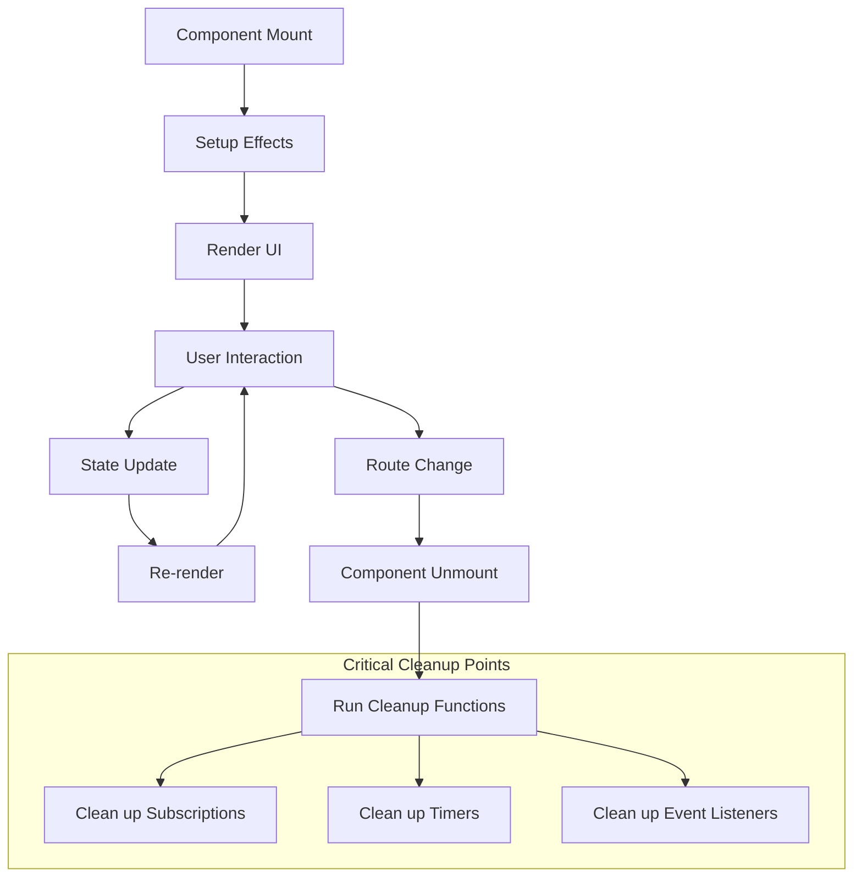
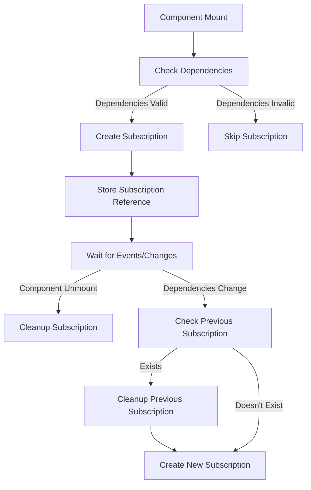
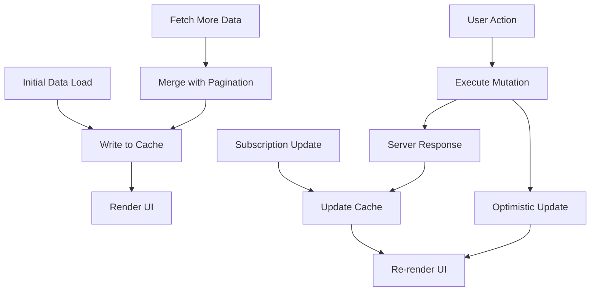
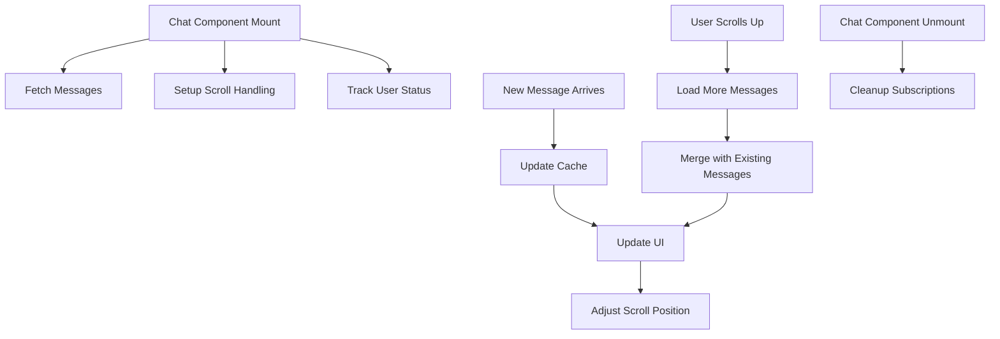

# Apollo Chat Frontend Lifecycle and Effect Management

## Overview

Effective lifecycle and effect management is critical in Apollo Chat for maintaining performance, preventing memory leaks, and ensuring a smooth user experience. This document explains how the application manages component lifecycles, side effects, and particularly GraphQL subscriptions.

## Component Lifecycle Management

React components in Apollo Chat follow a predictable lifecycle that we carefully manage to prevent performance issues:



### Key Lifecycle Patterns

1. **Mount Phase**: Initialize state, set up subscriptions, and fetch initial data
2. **Update Phase**: React to prop/state changes, update subscriptions if needed
3. **Unmount Phase**: Clean up subscriptions, timers, and event listeners

## Effect Management with useEffect

Apollo Chat uses React's `useEffect` hook to manage side effects throughout the application:

```javascript
// Pattern for effect with cleanup
useEffect(() => {
  // Setup phase: Initialize resources
  const resource = setupResource();

  // Return cleanup function
  return () => {
    // Cleanup phase: Release resources
    cleanupResource(resource);
  };
}, [dependencies]); // Dependencies control when effect runs
```

### Common Effect Patterns

1. **Data Fetching**:

   ```javascript
   useEffect(() => {
     // Only fetch if we have a valid ID
     if (chatId) {
       countMessages();
     }
   }, [countMessages]); // Re-fetch when dependency changes
   ```

2. **Event Listeners**:

   ```javascript
   useEffect(() => {
     const handleResize = () => setWindowSize(getWindowDimensions());
     window.addEventListener("resize", handleResize);

     return () => {
       window.removeEventListener("resize", handleResize);
     };
   }, []); // Empty dependency array = run once on mount
   ```

3. **UI Updates**:

   ```javascript
   useEffect(() => {
     if (messages?.messages && messages.messages.length <= PAGE_SIZE) {
       setMessage("");
       scrollToBottom();
     }
   }, [location.pathname, messages]);
   ```

## GraphQL Subscription Lifecycle Management

Managing GraphQL subscriptions correctly is crucial to prevent memory leaks. Apollo Chat implements a robust pattern for subscription management:



### Message Subscription Implementation

The `useMessageCreated` hook demonstrates our subscription management pattern:

```javascript
export const useMessageCreated = (
  variables: SubscriptionMessageCreatedArgs
) => {
  // Get Apollo client instance
  const client = useApolloClient();

  // Only subscribe if we have chat IDs
  const skip = !variables.chatIds || variables.chatIds.length === 0;

  // Store subscription reference for cleanup
  const [subscriptionRef, setSubscriptionRef] = useState<{
    unsubscribe: () => void;
  } | null>(null);

  // Track previous chat IDs to detect changes
  const prevChatIdsRef = useRef<string[]>([]);

  // Setup subscription with proper cleanup
  useEffect(() => {
    // Skip if no chat IDs
    if (skip) return;

    // Convert chat IDs to string for comparison
    const currentChatIdsStr = JSON.stringify(variables.chatIds);
    const prevChatIdsStr = JSON.stringify(prevChatIdsRef.current);

    // Clean up previous subscription if chat IDs changed
    if (subscriptionRef && currentChatIdsStr !== prevChatIdsStr) {
      console.log("Chat IDs changed, cleaning up previous subscription");
      subscriptionRef.unsubscribe();
    }

    // Create new subscription
    console.log(
      `Creating message subscription for chats: ${variables.chatIds.join(", ")}`
    );
    const subscription = client
      .subscribe({
        query: messageCreatedDocument,
        variables,
      })
      .subscribe({
        next: ({ data }) => {
          try {
            if (data?.messageCreated) {
              updateMessages(client.cache, data.messageCreated);
              updateLatestMessage(client.cache, data.messageCreated);
            }
          } catch (error) {
            console.error("Error in messageCreated handler:", error);
          }
        },
        error: (error) => {
          console.error("Subscription error:", error);
        },
      });

    // Store reference and update previous chat IDs
    setSubscriptionRef(subscription);
    prevChatIdsRef.current = [...variables.chatIds];

    // Cleanup on unmount or variables change
    return () => {
      if (subscription) {
        console.log(
          `Cleaning up message subscription for chats: ${variables.chatIds.join(
            ", "
          )}`
        );
        subscription.unsubscribe();
      }
    };
  }, [skip, JSON.stringify(variables.chatIds), client]);

  // For backward compatibility, return a similar structure to useSubscription
  return {
    loading: false,
    data: null,
    error: null,
  };
};
```

### Chat Subscriptions Implementation

The `useChatSubscriptions` hook manages two separate subscriptions:

```javascript
export const useChatSubscriptions = () => {
  // Get Apollo client instance
  const client = useApolloClient();

  // Store subscription references for cleanup
  const [chatAddedSubRef, setChatAddedSubRef] = useState<{
    unsubscribe: () => void;
  } | null>(null);
  const [chatDeletedSubRef, setChatDeletedSubRef] = useState<{
    unsubscribe: () => void;
  } | null>(null);

  // Setup chat added subscription with proper cleanup
  useEffect(() => {
    console.log("Creating chat added subscription");

    // Create new subscription
    const subscription = client
      .subscribe({
        query: chatAddedDocument,
      })
      .subscribe({
        next: ({ data }) => {
          try {
            if (data?.chatAdded) {
              updateChatAdded(client.cache, data.chatAdded);
            }
          } catch (error) {
            console.error("Error in chatAdded handler:", error);
          }
        },
        error: (error) => {
          console.error("Chat added subscription error:", error);
        },
      });

    // Store reference
    setChatAddedSubRef(subscription);

    // Cleanup on unmount
    return () => {
      if (subscription) {
        console.log("Cleaning up chat added subscription");
        subscription.unsubscribe();
      }
    };
  }, [client]);

  // Setup chat deleted subscription with proper cleanup
  useEffect(() => {
    console.log("Creating chat deleted subscription");

    // Create new subscription
    const subscription = client
      .subscribe({
        query: chatDeletedDocument,
      })
      .subscribe({
        next: ({ data }) => {
          try {
            if (data?.chatDeleted) {
              updateChatDeleted(client.cache, data.chatDeleted._id);
            }
          } catch (error) {
            console.error("Error in chatDeleted handler:", error);
          }
        },
        error: (error) => {
          console.error("Chat deleted subscription error:", error);
        },
      });

    // Store reference
    setChatDeletedSubRef(subscription);

    // Cleanup on unmount
    return () => {
      if (subscription) {
        console.log("Cleaning up chat deleted subscription");
        subscription.unsubscribe();
      }
    };
  }, [client]);

  // For backward compatibility, return a similar structure to previous implementation
  return {
    chatAddedLoading: false,
    chatAddedError: null,
    chatDeletedLoading: false,
    chatDeletedError: null,
  };
};
```

### User Status Subscription Implementation

The `useUserStatus` hook follows the same pattern as the message subscription:

```javascript
export const useUserStatus = (userIds: string[]) => {
  // Get Apollo client instance
  const client = useApolloClient();

  // Only subscribe if we have user IDs
  const skip = !userIds || userIds.length === 0;

  // Store subscription reference for cleanup
  const [subscriptionRef, setSubscriptionRef] = useState<{
    unsubscribe: () => void;
  } | null>(null);

  // Track previous user IDs to detect changes
  const prevUserIdsRef = useRef<string[]>([]);

  // Setup subscription with proper cleanup
  useEffect(() => {
    // Skip if no user IDs
    if (skip) return;

    // Convert user IDs to string for comparison
    const currentUserIdsStr = JSON.stringify(userIds);
    const prevUserIdsStr = JSON.stringify(prevUserIdsRef.current);

    // Clean up previous subscription if user IDs changed
    if (subscriptionRef && currentUserIdsStr !== prevUserIdsStr) {
      console.log("User IDs changed, cleaning up previous subscription");
      subscriptionRef.unsubscribe();
    }

    // Create new subscription
    console.log(
      `Creating user status subscription for users: ${userIds.join(", ")}`
    );
    const subscription = client
      .subscribe({
        query: USER_STATUS_SUBSCRIPTION,
        variables: { userIds },
      })
      .subscribe({
        next: ({ data }) => {
          try {
            if (data?.userStatusChanged) {
              // Data will be automatically updated in the cache
              console.log("User status changed:", data.userStatusChanged);
            }
          } catch (error) {
            console.error("Error in userStatus handler:", error);
          }
        },
        error: (error) => {
          console.error("User status subscription error:", error);
        },
      });

    // Store reference and update previous user IDs
    setSubscriptionRef(subscription);
    prevUserIdsRef.current = [...userIds];

    // Cleanup on unmount or variables change
    return () => {
      if (subscription) {
        console.log(
          `Cleaning up user status subscription for users: ${userIds.join(
            ", "
          )}`
        );
        subscription.unsubscribe();
      }
    };
  }, [skip, JSON.stringify(userIds), client]);

  // For backward compatibility, return a similar structure to useSubscription
  return {
    loading: false,
    data: null,
    error: null,
  };
};
```

## Cache Operations and Data Flow

Apollo Chat implements a structured approach to cache operations that integrates with the component lifecycle:



### Data Loading Sequence

1. **Initial Data Load**:

   - Component mounts and triggers initial query
   - Data is written to cache
   - UI renders with initial data

2. **Subscription Updates**:

   - Subscription receives new data (e.g., new message)
   - Cache is updated with new data
   - UI re-renders with updated data

3. **Pagination (Fetch More)**:
   - User scrolls to load more messages
   - Additional data is fetched
   - New data is merged with existing data in cache
   - UI updates to show more messages

### Cache Update Timing

Cache updates occur at specific points in the component lifecycle:

1. **After Initial Query**: Data is written to cache after initial query completes
2. **After Subscription Event**: Cache is updated when subscription receives new data
3. **After Mutation**: Cache is updated after mutation completes
4. **After Fetch More**: Cache is updated with paginated data

## Scroll Behavior and Message Loading

The Chat component manages scroll position and message loading:

```javascript
// Define scroll to bottom function
const scrollToBottom = () =>
  divRef.current?.scrollIntoView({ behavior: "smooth" });

// Scroll to bottom when messages change
useEffect(() => {
  if (messages?.messages && messages.messages.length <= PAGE_SIZE) {
    setMessage("");
    scrollToBottom();
  }
}, [location.pathname, messages]);

// Handle loading more messages when scrolling up
const handleLoadMore = useCallback(() => {
  if (!messages?.messages?.length || messagesLoading) return;

  if (messagesCount !== undefined && messages.messages.length >= messagesCount)
    return;

  setTimeout(() => {
    fetchMore({
      variables: {
        chatId,
        skip: messages.messages.length,
        limit: PAGE_SIZE,
      },
    }).catch((error) => {
      console.error("Error loading more messages:", error);
    });
  }, 0);
}, [messages?.messages, messagesLoading, messagesCount, fetchMore, chatId]);
```

### Scroll Management Strategies

1. **Initial Load**: Scroll to bottom when messages first load
2. **New Message**: Scroll to bottom after sending a message
3. **Load More (Pagination)**: Maintain scroll position when loading history using InfiniteScroll

## Common Lifecycle Challenges and Solutions

### 1. Dependency Array Management

**Challenge**: Missing or incorrect dependencies can cause stale closures or infinite re-renders.

**Solution**: Apollo Chat uses proper dependency arrays and follows these patterns:

```javascript
// Correct: All dependencies included
useEffect(() => {
  countMessages();
}, [countMessages]);

// Using JSON.stringify for array dependencies
useEffect(() => {
  // Effect code
}, [skip, JSON.stringify(userIds), client]);
```

### 2. Subscription Memory Leaks

**Challenge**: Unmanaged subscriptions can cause memory leaks and performance degradation.

**Solution**: Apollo Chat implements a consistent pattern for subscription cleanup:

1. **Store subscription references** using `useState`
2. **Track variable changes** to detect when subscriptions need to be recreated
3. **Clean up on unmount** by returning cleanup functions from `useEffect`
4. **Clean up on variable change** by unsubscribing before creating new subscriptions

### 3. Race Conditions in Data Fetching

**Challenge**: When fetching data based on changing dependencies, responses may arrive out of order.

**Solution**: Apollo Chat uses a timeout in the fetch more function to help prevent race conditions:

```javascript
setTimeout(() => {
  fetchMore({
    variables: {
      chatId,
      skip: messages.messages.length,
      limit: PAGE_SIZE,
    },
  }).catch((error) => {
    console.error("Error loading more messages:", error);
  });
}, 0);
```

## Component-Specific Lifecycle Management

### Chat Component

The Chat component manages several effects:

1. **Message Loading**: Fetches message history when the component mounts
2. **Scroll Management**: Handles scroll position when new messages arrive or when route changes
3. **User Status Tracking**: Subscribes to status updates for all users in the chat



## Best Practices

1. **Always clean up subscriptions** when components unmount
2. **Track and clean up previous subscriptions** when dependencies change
3. **Use consistent patterns** across the application for predictability
4. **Add logging for subscription lifecycle events** to aid debugging
5. **Consider component unmount timing** when dealing with asynchronous operations
6. **Use proper dependency arrays** to prevent stale closures and unnecessary re-renders
7. **Handle race conditions** in asynchronous effects
8. **Test component lifecycles** thoroughly, especially unmount scenarios
