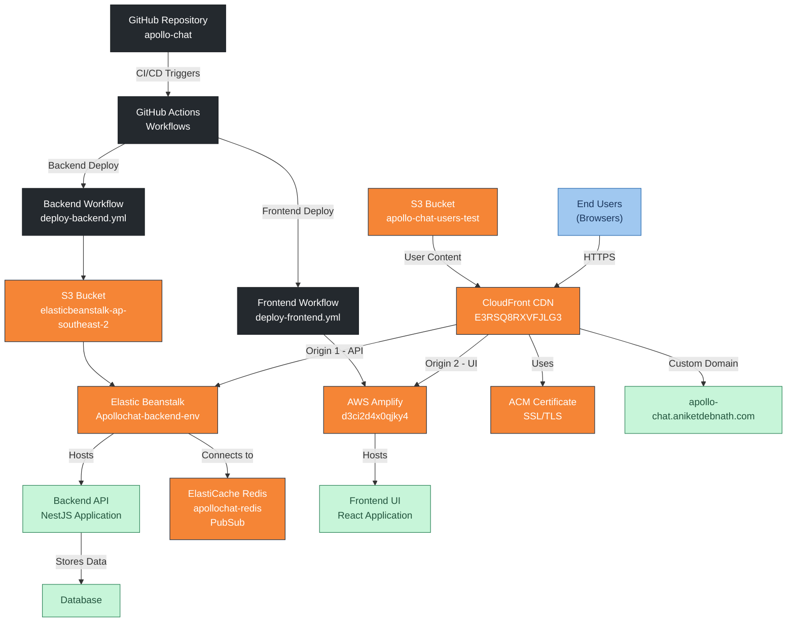

# Apollo Chat Deployment Architecture

## Overview

Apollo Chat is deployed using AWS services with a CI/CD pipeline implemented through GitHub Actions. The application consists of:

- **Frontend**: React application deployed on AWS Amplify
- **Backend**: NestJS application deployed on AWS Elastic Beanstalk
- **Cache**: Redis OSS on AWS ElastiCache
- **Storage**: AWS S3 for file storage
- **CDN**: AWS CloudFront for content delivery
- **Domain**: Custom domain with SSL certificate through AWS Certificate Manager

## Architecture Diagram

## Infrastructure Components

### Frontend (AWS Amplify)

- **Hosting**: AWS Amplify
- **Framework**: React
- **Custom Domain**: apollo-chat.aniketdebnath.com (via CloudFront)
- **Amplify URL**: https://master.d3ci2d4x0qjky4.amplifyapp.com
- **SSL**: Managed via AWS ACM (Cert ID: 74889dbd-5d6d-4722-8fc8-8a9107419c07)

### Backend (AWS Elastic Beanstalk)

- **Service**: AWS Elastic Beanstalk
- **Environment Name**: Apollochat-backend-env
- **Environment ID**: e-muwpwiddmb
- **Application Name**: apollochat-backend
- **Platform**: Node.js 22 running on 64bit Amazon Linux 2023/6.5.2
- **URL**: Apollochat-backend-env.eba-y8r2bnhz.ap-southeast-2.elasticbeanstalk.com
- **Running Version**: GitHub SHA-tagged ZIPs (stored in S3)
- **S3 Bucket**: elasticbeanstalk-ap-southeast-2-680871074175

### Redis PubSub Cache (AWS ElastiCache)

- **Service**: Redis OSS Cache
- **Cluster name**: apollochat-redis
- **Node type**: cache.t2.micro
- **Engine**: Redis 7.1.0
- **Purpose**: Used for PubSub functionality
- **Configuration**:
  - Cluster mode: Disabled
  - Shards: 1
  - Number of nodes: 1
  - Multi-AZ: Disabled
  - Auto-failover: Disabled

### Storage (AWS S3)

- **Deployment Bucket**: elasticbeanstalk-ap-southeast-2-680871074175
  - Used for storing deployment artifacts from GitHub Actions
- **User Content Bucket**: apollo-chat-users-test
  - Used for storing user profile pictures

### CDN Layer (AWS CloudFront)

- **Distribution ID**: E3RSQ8RXVFJLG3
- **Domain**: d1h9rqfini6hni.cloudfront.net
- **Custom Domain**: apollo-chat.aniketdebnath.com
- **SSL Certificate**: ACM certificate (ID: 74889dbd-5d6d-4722-8fc8-8a9107419c07)
- **Origins**:
  - Backend: apollochat-backend-env.eba-y8r2bnhz.ap-southeast-2.elasticbeanstalk.com (HTTP only, port 80)
    - Path pattern: /api/\*
    - Allowed Methods: GET, HEAD, OPTIONS, PUT, POST, PATCH, DELETE
    - Cache policy: CachingDisabled
    - Origin request policy: AllViewer
  - Frontend: master.d3ci2d4x0qjky4.amplifyapp.com (HTTPS only, port 443)
    - Path pattern: Default (\*)
    - Allowed Methods: GET, HEAD, OPTIONS
    - Cache policy: CachingDisabled

## CI/CD Pipeline

### Backend Deployment (GitHub Actions)

- **Trigger**: Push to master branch with changes in apollochat-backend directory
- **Manual Trigger**: Workflow dispatch
- **Process**:
  1. Checkout repository
  2. Configure AWS credentials using secrets
  3. Set up Node.js 18
  4. Install pnpm
  5. Install backend dependencies
  6. Build backend
  7. Prepare deployment artifacts
  8. Generate unique version label
  9. Zip backend for Elastic Beanstalk
  10. Upload to S3 bucket
  11. Create new Elastic Beanstalk version
  12. Deploy to Elastic Beanstalk environment

### Frontend Deployment (GitHub Actions)

- **Trigger**: Push to master branch with changes in apollochat-ui directory
- **Manual Trigger**: Workflow dispatch
- **Process**:
  1. Configure AWS credentials using secrets
  2. Trigger Amplify build job

## Domain Configuration

- **Primary Domain**: aniketdebnath.com
- **Subdomain**: apollo-chat.aniketdebnath.com
- **SSL Certificate**: Managed through AWS Certificate Manager
- **DNS**: Custom domain managed via GoDaddy using CNAME records, routed through AWS CloudFront

## Security

- AWS credentials stored as GitHub secrets
- HTTPS enforced for frontend
- SSL/TLS minimum protocol: TLSv1.2
- Authentication managed through backend APIs

## Notes: Previous Setup – CodePipeline (Deprecated)

Apollo Chat was previously deployed using AWS CodePipeline services:

- **AWS CodeBuild**: Used `buildspec.yml` to build the application
- **AWS CodeDeploy**: Handled the deployment to target environments
- **AWS CodePipeline**: Orchestrated the CI/CD workflow

The project has since migrated to GitHub Actions for several reasons:

- Faster iteration cycles
- Cost efficiency (GitHub Actions is free for public repositories)
- Simpler configuration with YAML files in the repository
- Better integration with the GitHub ecosystem

Legacy files like `buildspec.yml` may still exist in the repository but are no longer active in the deployment process.

### Cost Optimization

The entire deployment architecture is designed to operate within AWS Free Tier limits:

- Elastic Beanstalk with t2.micro instances
- ElastiCache with cache.t2.micro node
- S3 with minimal storage requirements
- CloudFront with limited data transfer
- AWS Amplify with free tier hosting
