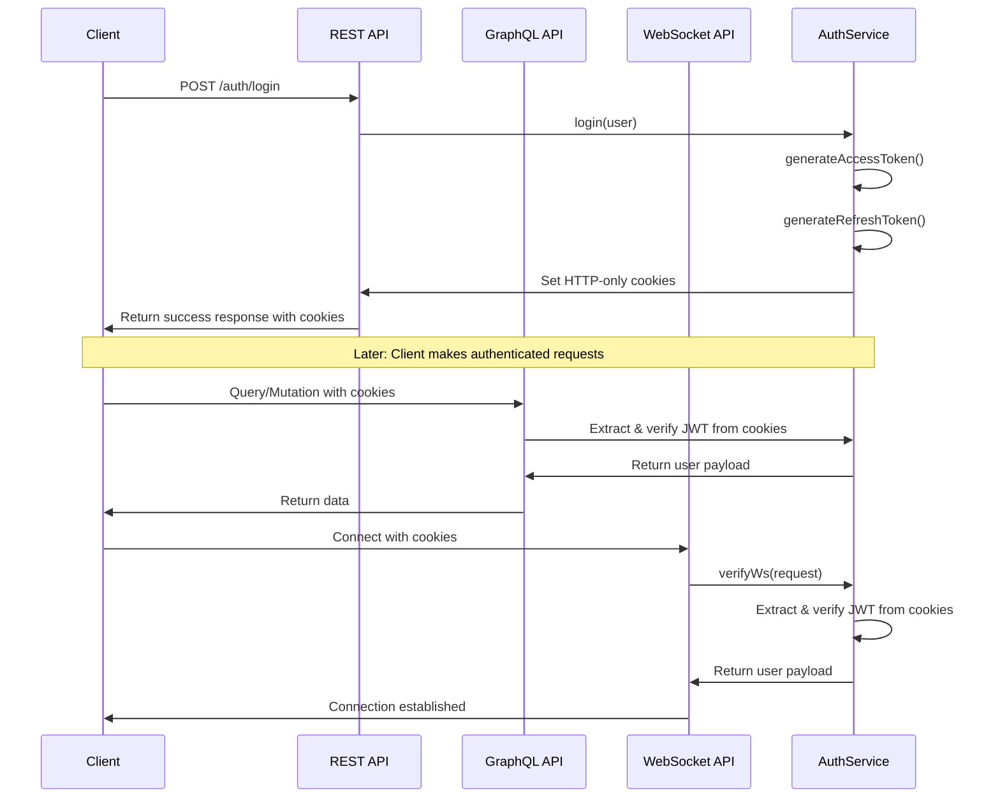
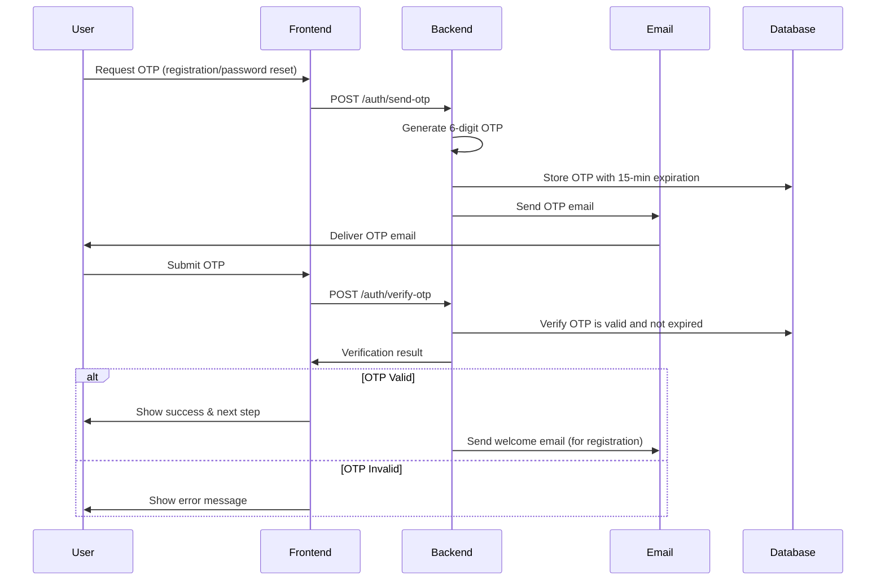
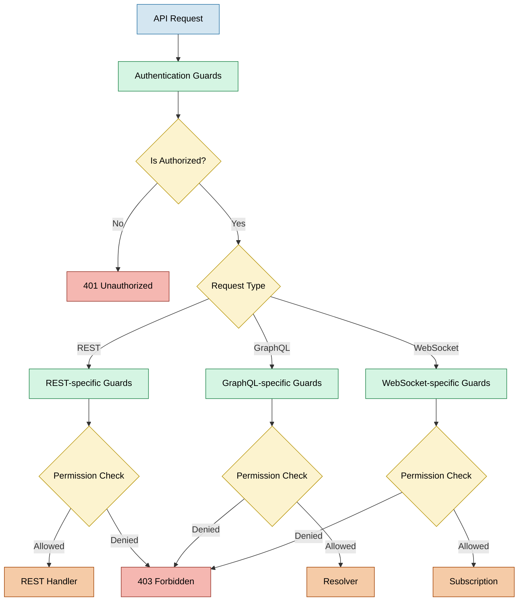

# Apollo Chat Security Architecture

## Overview

Apollo Chat implements a comprehensive, multi-layered security architecture that spans both frontend and backend components. This document provides a detailed overview of the security features, authentication flows, and protection mechanisms implemented throughout the application.

## Core Security Features

### Authentication System

Apollo Chat uses a robust token-based authentication system with refresh token rotation:



#### Key Authentication Features

1. **JWT with Refresh Tokens**

   - Short-lived access tokens (JWT) for API access
   - Long-lived refresh tokens for obtaining new access tokens
   - Token rotation on refresh for enhanced security
   - Secure storage in HTTP-only cookies

```typescript
private setTokenCookies(
  response: Response,
  accessToken: string,
  refreshToken: string,
) {
  response.cookie("Authentication", accessToken, {
    httpOnly: true,
    expires: accessExpires,
    sameSite: "strict",
    secure: this.configService.get("NODE_ENV") === "production",
  });

  response.cookie("Refresh", refreshToken, {
    httpOnly: true,
    expires: refreshExpires,
    sameSite: "strict",
    secure: this.configService.get("NODE_ENV") === "production",
  });
}
```

2. **Cross-Protocol Authentication**

   - Consistent authentication across REST, GraphQL, and WebSocket
   - Specialized guards for each protocol
   - Automatic token refresh when expired

3. **Multiple Authentication Methods**

   - Username/password authentication
   - Google OAuth integration
   - Demo user authentication with restricted permissions

4. **Session Management**
   - Multiple device login support
   - "Logout from all devices" functionality
   - Token revocation on password change
   - Session tracking with user agent and IP information

### OTP Verification System

Apollo Chat implements a One-Time Password (OTP) system for email verification and password reset:



#### Key OTP Features

1. **Email Verification**

   - 6-digit numeric codes with 15-minute expiration
   - Required for sensitive operations
   - Welcome email sent after successful verification

```typescript
async generateAndSendOtp(email: string): Promise<boolean> {
  const otp = Math.floor(100000 + Math.random() * 900000).toString();

  const expiresAt = new Date();
  expiresAt.setMinutes(expiresAt.getMinutes() + 15);

  await this.otpModel.deleteMany({ email });

  const otpVerification = new this.otpModel({
    _id: new Types.ObjectId(),
    email,
    otp,
    expiresAt,
  });

  await otpVerification.save();

  const emailSent = await this.emailService.sendOtpEmail(email, otp);

  if (this.configService.get('NODE_ENV') !== 'production') {
    console.log(`OTP for ${email}: ${otp}`);
  }

  return emailSent;
}
```

2. **Password Reset**

   - Secure password reset flow
   - OTP verification before password change
   - All sessions invalidated after password reset

3. **Rate Limiting**

   - Send OTP: 1 request per minute
   - Verify OTP: 5 attempts per minute
   - Check verification status: 10 checks per minute

```typescript
@Injectable()
export class OtpThrottlerGuard extends ThrottlerBehindProxyGuard {
  protected getTrackerOptions(context: ExecutionContext): ThrottlerOptions {
    const request = this.getRequestResponse(context).req;
    const path = request.path || "";

    if (path.includes("/auth/send-otp")) {
      return {
        ttl: 60000, // 1 minute
        limit: 1,
      };
    } else if (path.includes("/auth/verify-otp")) {
      return {
        ttl: 60000,
        limit: 5,
      };
    } else if (path.includes("/auth/check-email-verified")) {
      return {
        ttl: 60000,
        limit: 10,
      };
    }

    return {
      ttl: 60000,
      limit: 20,
    };
  }
}
```

4. **Anti-Enumeration Protection**
   - Success response returned even for non-existent emails
   - Prevents user enumeration attacks

### Access Control System

Apollo Chat implements a comprehensive access control system:



#### Key Access Control Features

1. **Authentication Guards**

   - JwtAuthGuard for REST endpoints
   - GqlAuthGuard for GraphQL operations
   - WebSocket connection authentication
   - OAuth-specific guards (GoogleAuthGuard)

```typescript
export class JwtAuthGuard extends AuthGuard("jwt") {}

export class GqlAuthGuard extends AuthGuard("jwt") {
  getRequest(context: ExecutionContext): Request {
    const ctx = GqlExecutionContext.create(context);
    const request = ctx.getContext<{ req: Request }>().req;
    return request;
  }
}
```

2. **Permission Controls**

   - Creator-only operations for chat management
   - Member-only access to private chats
   - Public/private chat visibility rules
   - Demo user restrictions

3. **Frontend Authorization**

   - Guard component for route protection
   - Conditional rendering based on permissions
   - Authentication state management

```typescript
const Guard = ({ children }: GuardProps) => {
  const { data: user, error } = useGetMe();
  const { path } = usePath();

  useEffect(() => {
    if (user) {
      authenticatedVar(true);
    }
  }, [user]);

  useEffect(() => {
    if (error?.networkError && !isAuthError(error)) {
      snackVar(UNKNOWN_ERROR_SNACK_MESSAGE);
    }
  }, [error]);

  return <>{excludedRoutes.includes(path) ? children : user && children}</>;
};
```

## Protection Mechanisms

### Rate Limiting

Apollo Chat implements comprehensive rate limiting to prevent abuse:

1. **Global Rate Limiting**

   - Base limit: 100 requests per minute per IP
   - Applies to all endpoints by default
   - Custom error messages for rate-limited requests

```typescript
@Module({
  imports: [
    ThrottlerModule.forRoot([
      {
        ttl: 60000, // 60 seconds in milliseconds
        limit: 100, // 100 requests per TTL
      },
    ]),
  ],
  providers: [
    {
      provide: APP_GUARD,
      useClass: ThrottlerBehindProxyGuard,
    },
  ],
})
export class SecurityModule {}
```

2. **Endpoint-Specific Limits**

   - Authentication endpoints: Stricter limits
   - OTP endpoints: Customized based on operation sensitivity
   - GraphQL operations: Protected via specialized guard

3. **Proxy-Aware Implementation**

   - ThrottlerBehindProxyGuard for accurate client IP detection
   - Works with CDN/proxy configurations
   - Handles both HTTP and GraphQL contexts

```typescript
@Injectable()
export class ThrottlerBehindProxyGuard extends ThrottlerGuard {
  protected getTracker(req: Request): Promise<string> {
    return new Promise<string>((resolve) => {
      if (!req || !req.headers) {
        resolve("unknown");
        return;
      }

      if (req.headers["x-forwarded-for"]) {
        const forwardedIps = Array.isArray(req.headers["x-forwarded-for"])
          ? req.headers["x-forwarded-for"][0]
          : req.headers["x-forwarded-for"];

        const clientIp = forwardedIps.split(",")[0].trim();
        resolve(clientIp);
        return;
      }

      const tracker = req.ips?.length > 0 ? req.ips[0] : req.ip || "unknown";
      resolve(tracker);
    });
  }
}
```

### Input Validation & Sanitization

1. **SecurityInterceptor**

   - Intercepts HTTP requests
   - Detects suspicious patterns in user agents and request paths
   - Sanitizes input fields to prevent XSS attacks
   - Blocks potential SQL injection attempts

```typescript
@Injectable()
export class SecurityInterceptor implements NestInterceptor {
  private readonly logger = new Logger(SecurityInterceptor.name);

  constructor(private readonly securityService: SecurityService) {}

  intercept(context: ExecutionContext, next: CallHandler): Observable<any> {
    try {
      const request = context.switchToHttp().getRequest<Request>();

      if (!request) {
        return next.handle();
      }

      const userAgent = request.headers?.["user-agent"];
      const path = request.path;

      if (
        userAgent &&
        path &&
        this.securityService.isSuspiciousRequest(userAgent, path)
      ) {
        throw new BadRequestException("Invalid request");
      }

      if (request.body) {
        const body = request.body as Record<string, unknown>;
        const fieldsToSanitize = [
          "name",
          "title",
          "description",
          "message",
          "content",
        ];

        for (const field of fieldsToSanitize) {
          if (typeof body[field] === "string") {
            body[field] = this.securityService.sanitizeInput(body[field]);
          }
        }
      }
    } catch (error) {
      this.logger.error("Error in security interceptor", error);
    }

    return next.handle();
  }
}
```

2. **Input Validation**

   - DTO validation with class-validator
   - GraphQL input type validation
   - Frontend form validation

3. **Error Handling**
   - Sanitized error messages
   - Prevents information disclosure
   - Consistent error response format

### Demo User Protection

Apollo Chat implements special protections for demo accounts:

1. **DemoUserInterceptor**

   - Intercepts requests from demo users
   - Allows read operations
   - Blocks write operations (POST, PUT, PATCH, DELETE)
   - Blocks GraphQL mutations

```typescript
@Injectable()
export class DemoUserInterceptor implements NestInterceptor {
  private readonly logger = new Logger(DemoUserInterceptor.name);
  private readonly DEMO_EMAIL = "demo@apollochat.com";
  private readonly WRITE_METHODS = ["POST", "PUT", "PATCH", "DELETE"];
  private readonly ALLOWED_PATHS = ["/auth/login", "/auth/logout"];

  intercept(context: ExecutionContext, next: CallHandler): Observable<any> {
    try {
      const contextType = context.getType<string>();

      if (contextType === "http") {
        const request = context.switchToHttp().getRequest<Request>();
        const user = request.user as UserWithEmail;
        const path = request.path;

        if (this.ALLOWED_PATHS.includes(path)) {
          return next.handle();
        }

        if (
          user?.email === this.DEMO_EMAIL &&
          this.WRITE_METHODS.includes(request.method)
        ) {
          throw new ForbiddenException("Demo account is read-only");
        }
      } else if (contextType === "graphql") {
        const gqlContext = GqlExecutionContext.create(context);
        const ctx = gqlContext.getContext<GqlContext>();
        const user = ctx.req?.user;
        const info = gqlContext.getInfo<GraphQLResolveInfo>();

        if (
          user?.email === this.DEMO_EMAIL &&
          info.operation &&
          info.operation.operation === "mutation"
        ) {
          throw new ForbiddenException("Demo account is read-only");
        }
      }
    } catch (error) {
      if (error instanceof ForbiddenException) {
        throw error;
      }
      this.logger.error("Error in demo user interceptor", error);
    }

    return next.handle();
  }
}
```

2. **Frontend Integration**
   - Detects demo restriction errors
   - Shows appropriate messages to users
   - Disables write operations in UI for demo users

## Frontend Security Implementation

### Authentication State Management

1. **Reactive Variables**

   - `authenticatedVar` tracks authentication state
   - Updates UI reactively when authentication changes
   - Used by Guard component for route protection

2. **Token Refresh Mechanism**

   - Automatic token refresh on 401 errors
   - Handles race conditions with single refresh promise
   - Redirects to login on refresh failure

```typescript
export const refreshAccessToken = async (): Promise<boolean> => {
  if (isRefreshing) {
    return refreshPromise!;
  }

  isRefreshing = true;

  refreshPromise = new Promise<boolean>(async (resolve) => {
    try {
      const response = await fetch(getRelativeApiUrl("/auth/refresh"), {
        method: "POST",
        credentials: "include",
      });

      isRefreshing = false;
      resolve(response.ok);
    } catch (error) {
      isRefreshing = false;
      resolve(false);
    }
  });

  return refreshPromise;
};
```

3. **Guard Component**
   - Protects routes from unauthenticated access
   - Checks user data from `useGetMe` hook
   - Allows access to excluded routes (login, signup)

### Error Handling

1. **Authentication Errors**

   - Detected and handled separately from other errors
   - Triggers token refresh flow when appropriate
   - Prevents unnecessary error messages for auth issues

```typescript
const errorLink = onError(({ graphQLErrors, operation, forward }) => {
  const demoError = graphQLErrors?.find((error) =>
    error.message.includes("Demo account is read-only")
  );

  if (demoError) {
    snackVar(DEMO_ERROR_SNACK_MESSAGE);
    return forward(operation);
  }

  const authError = graphQLErrors?.find(
    (error) =>
      error.extensions?.code === "UNAUTHENTICATED" ||
      (error.extensions?.originalError as any)?.statusCode === 401
  );

  if (
    excludedRoutes.some((route) => window.location.pathname.includes(route))
  ) {
    return forward(operation);
  }

  if (authError) {
    return fromPromise(refreshAccessToken()).flatMap((success) => {
      if (success) {
        return forward(operation);
      } else {
        onLogout();
        return forward(operation);
      }
    });
  }

  return forward(operation);
});
```

2. **Network Errors**
   - Displayed to users with appropriate messages
   - Handled globally through Apollo error links
   - Retried automatically when possible

### Secure Forms

1. **Password Handling**

   - Client-side validation for password strength
   - Secure transmission via HTTPS
   - No password storage in frontend state

2. **OTP Verification**
   - Rate limit detection and user feedback
   - Cooldown timers for resend functionality
   - Clear error messages for failed verification

## Backend Security Implementation

### Authentication Strategies

1. **JWT Strategy**

   - Extracts and validates JWT tokens from cookies
   - Configurable secret key and expiration
   - Returns user payload for request context

```typescript
@Injectable()
export class JwtStrategy extends PassportStrategy(Strategy) {
  constructor(private readonly configService: ConfigService) {
    super({
      jwtFromRequest: ExtractJwt.fromExtractors([
        (request: Request) => request.cookies.Authentication,
      ]),
      secretOrKey: configService.getOrThrow("JWT_SECRET"),
    });
  }

  validate(payload: TokenPayload) {
    return payload;
  }
}
```

2. **Local Strategy**

   - Validates username/password credentials
   - Securely compares password hashes
   - Returns user object on successful authentication

```typescript
@Injectable()
export class LocalStrategy extends PassportStrategy(Strategy) {
  constructor(private readonly usersService: UsersService) {
    super({
      usernameField: "email",
    });
  }

  async validate(email: string, password: string) {
    try {
      return await this.usersService.verifyUser(email, password);
    } catch (err) {
      throw new UnauthorizedException("Credentials are not valid");
    }
  }
}
```

3. **Google Strategy**
   - Handles OAuth flow with Google
   - Creates or updates user with Google profile data
   - Issues standard application tokens after OAuth success

### Token Management

1. **Access Tokens**

   - Short-lived JWTs (configurable duration)
   - Contains minimal user information
   - Used for API authorization

2. **Refresh Tokens**

   - Longer-lived tokens stored in database
   - Associated with user, device, and IP information
   - Can be revoked individually or collectively
   - Rotated on each use for enhanced security

```typescript
@Schema({ versionKey: false })
export class RefreshToken extends AbstractEntity {
  @Prop({ type: Types.ObjectId, ref: "User", required: true })
  userId: Types.ObjectId;

  @Prop({ required: true })
  token: string;

  @Prop({ required: true })
  expiresAt: Date;

  @Prop({ default: false })
  revoked: boolean;

  @Prop()
  revokedAt?: Date;

  @Prop()
  userAgent?: string;

  @Prop()
  ipAddress?: string;
}
```

3. **Cookie Security**
   - HTTP-only flag prevents JavaScript access
   - Secure flag ensures HTTPS-only transmission
   - SameSite policy prevents CSRF attacks
   - Configurable expiration times

### Email Security

1. **Transactional Emails**

   - Secure SMTP connection for email delivery
   - HTML templates with plain text fallbacks
   - Rate limiting for email-related operations

2. **OTP Emails**
   - Time-limited verification codes
   - Clear instructions and security warnings
   - Specialized templates for different purposes (verification vs. password reset)

## Cross-Cutting Security Concerns

### CORS Configuration

Apollo Chat implements a secure CORS policy:

1. **Origin Restrictions**

   - Whitelist of allowed origins
   - Environment-specific configuration
   - Different settings for development and production

2. **Credential Support**
   - Allows credentials for authenticated requests
   - Necessary for cookie-based authentication
   - Properly configured with appropriate headers

### Error Handling

1. **Sanitized Responses**

   - No stack traces in production
   - Sanitized error messages
   - Consistent error format

2. **Logging**
   - Sensitive data redaction in logs
   - Different log levels for development and production
   - Error tracking for security-related issues

### Password Security

1. **Password Storage**

   - Bcrypt hashing with salt
   - Configurable work factor
   - No plain text passwords stored

2. **Password Policies**
   - Minimum length and complexity requirements
   - Frontend and backend validation
   - Secure password reset flow

## Security Best Practices

1. **Defense in Depth**

   - Multiple security layers
   - No single point of failure
   - Complementary security mechanisms

2. **Principle of Least Privilege**

   - Users only have access to what they need
   - Demo users have restricted permissions
   - Creator/member-specific permissions

3. **Secure by Default**

   - Security enabled by default
   - Explicit opt-in for public visibility
   - Conservative default settings

4. **Continuous Security Improvement**
   - Regular security reviews
   - Dependency updates
   - Evolving security practices

## Future Security Enhancements

1. **Enhanced Authentication**

   - Two-factor authentication
   - Additional OAuth providers
   - Biometric authentication options

2. **Advanced Monitoring**

   - Security event logging
   - Anomaly detection
   - Brute force attack prevention

3. **Infrastructure Security**

   - Container security
   - Network security policies
   - Secret management

4. **Compliance**
   - GDPR compliance enhancements
   - Privacy policy implementation
   - Data retention policies
